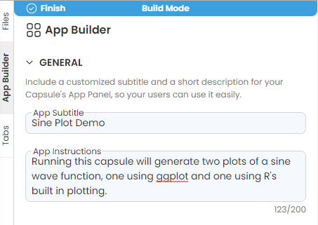
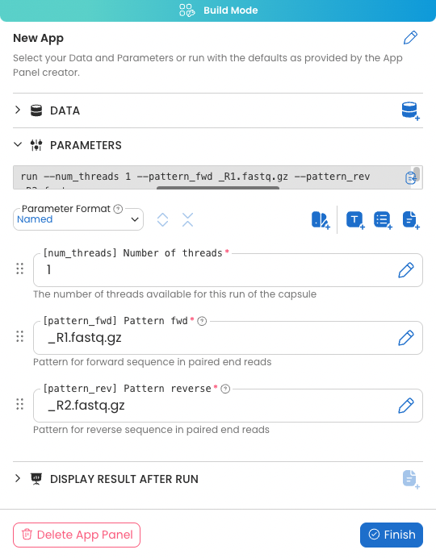
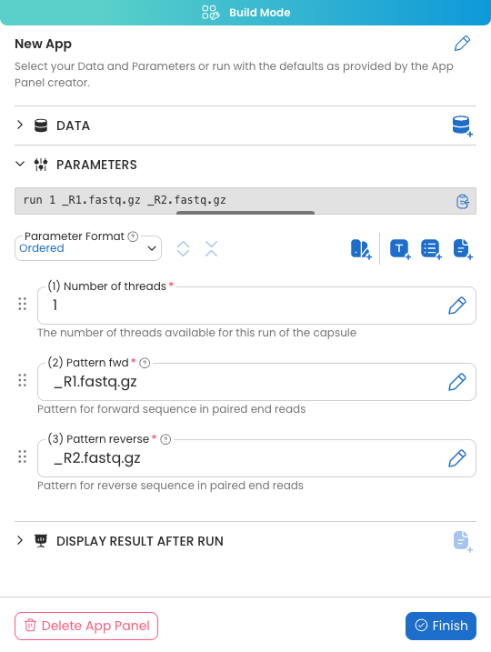
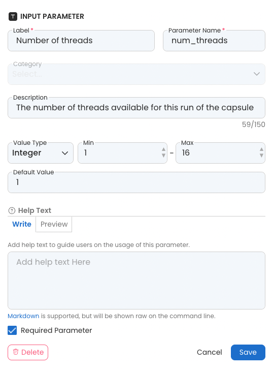
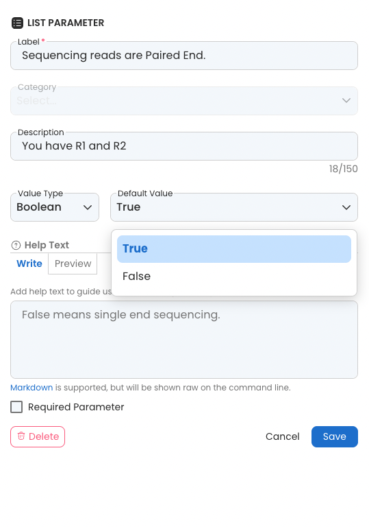
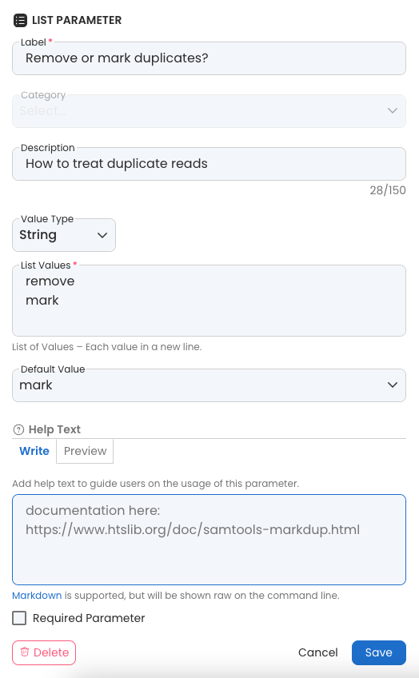
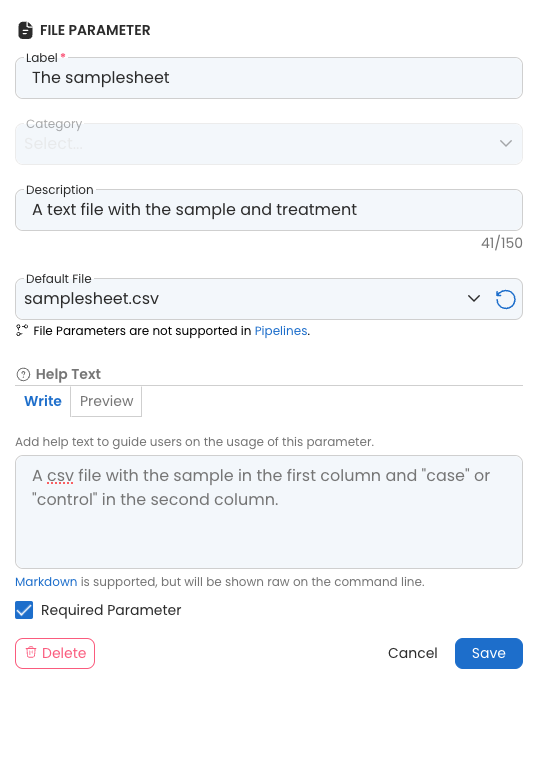
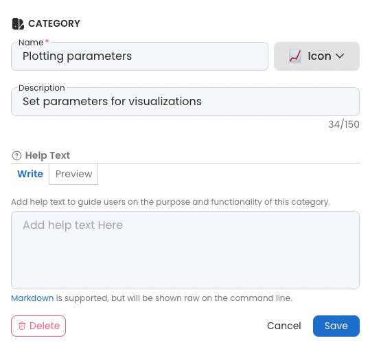

---
metaLinks:
  alternates:
    - >-
      https://app.gitbook.com/s/PvA82xvbvyt7rVs0IKXN/app-panel-guide/app-builder-user-interface
---

# App Builder User Interface

The App Builder contains four sections:&#x20;

* General - covers basic information about the App.
* Data - enables the attaching of Data Assets that can be swapped out.
* Parameters - set configurable parameters that are sent as arguments to run the script.
* Display Result After Run - choose output files to display  in the main window.

## General

This section allows you to set the title for the application along with a short description of the App usage. Once this section is filled out, it will include an automatic link to any`README.md`file contained within the Capsule. It is recommended to create a`README.md`file along with the application to help users understand the functionality of the tool, the inputs and outputs of the application, and any additional necessary information.

The example below shows the General section of a Capsule that plots a sine function.

<figure><figcaption></figcaption></figure>


This description will not appear outside of build mode until data or parameters have been added to the Capsule.&#x20;


## Data

Data consists of any Data Assets that can be attached to the Capsule. The Capsule should be coded using data found in the mount point of the Data Asset selected in build mode.

Data Assets that have been attached and set up outside the App Panel in the sliding window, can be replaced or swapped out. Edit access to the Capsule allows the attachment of new Data Assets using **Managing Data Assets** in the **Files** tab. However, if a Data Asset is used in the App Panel, there will be a warning message when trying to detach that Data Asset from the Capsule.

<figure><figcaption></figcaption></figure>

### Attaching Data Assets to the App

You can add a Data Asset that is already attached to the Capsule to this section as a default Data Asset.&#x20;


If there is no Data Asset attached yet, you will see a reminder to attach one.

&#x20;


* Click **Add**

<figure><figcaption></figcaption></figure>

*   Provide the following information:

    * Label
    * Default Data
    * Description

    <figure><figcaption></figcaption></figure>
* Click **Save**


Unlike other parameters, the Data Assets will be mounted to the Capsule and there is no argument for using it.


## Parameters

The App Builder supports three types of input parameters. The icons at the top of the Parameters panel represent each type:

<table><thead><tr><th width="96.33333333333331">Icon</th><th width="167">Type</th><th>Functionality</th></tr></thead><tbody><tr><td></td><td>Input Parameter</td><td>Choose between a string, number, or integer. The user can input free text that pass validation.</td></tr><tr><td></td><td>List Parameter</td><td>Select a value from a list.</td></tr><tr><td></td><td>File Parameter</td><td>Select an existing file in the <code>/data</code> directory or upload a file from your local machine.</td></tr></tbody></table>

### Named vs. Ordered parameters

Parameters must be passed to a script for the Capsule to recognize and use them. They may be passed using their name (`num_theads`) or in order (`1`).  For more information see [Passing App Panel's Parameters to the Script](../passing-app-panels-parameters-to-the-script.md).&#x20;

<figure><figcaption></figcaption></figure> <figure><figcaption></figcaption></figure>

A variety of information can be provided to help users enter appropriate values for each parameter, depending on the type of parameter and whether it is Named or Ordered.&#x20;



To clarify parameter usage, specify:

* Label: the name of the parameter in the App Panel. This field is required.&#x20;
* Parameter Name: For Named parameters only, a name that will be used in scripts. This field is required.&#x20;
* Category: The group the parameter belongs to.
* Description: A short text description of the parameter usage. This is visible in the App Panel view.&#x20;
* &#x20; Value Type: String, Number, or Integer.
  * For Strings, a validation pattern can be set to validate the input string.
  * For Integers and Numbers, a minimum and maximum value can be set.&#x20;
* Default Value: A value that will be entered into the parameter during a Reproducible Run, if not modified.&#x20;
* Help Text: Markdown supported text to instruct the user how to use the parameter.  This will be in a pinnable pop up in the App Panel view.&#x20;
* Required Parameter: Check whether this parameter must be filled out for the Capsule to run.

<figure><figcaption></figcaption></figure>



To clarify parameter usage, specify:

* Label: the name of the parameter in the App Panel. This field is required.&#x20;
* Category: The group the parameter belongs to.
* Description: A short text description of the parameter usage. This is visible in the App Panel view.&#x20;
* Value Type: String, Number, Integer, or Boolean.
* List Values: Any string, number, or integer that are possible parameter settings. This field is implied for Boolean (True, False) and required for the other Value Types.
* Default Value: One of the options in the list that will be entered into the parameter during a Reproducible Run, if not modified.
* Help Text: Markdown supported text to instruct the user how to use the parameter.  This will be in a pinnable pop up in the App Panel view.&#x20;

<figure><figcaption></figcaption></figure> <figure><figcaption></figcaption></figure>




To clarify parameter usage, specify:

* Label: the name of the parameter in the App Panel. This field is required.&#x20;
* Category: The group the parameter belongs to.
* Description: A short text description of the parameter usage. This is visible in the App Panel.&#x20;
* Default File: A file in the `/data` folder that will be entered into the parameter during a Reproducible Run, if not modified.
* Help Text: Markdown supported text to instruct the user how to use the parameter.  This will be in a pinnable pop up in the App Panel view.&#x20;
* Required Parameter: Check whether this parameter must be filled out for the Capsule to run.

<figure><figcaption></figcaption></figure>



### Adding parameters to categories

Categories can be created either before or after creating parameters, and parameters can be added into categories.&#x20;

To create a category, add the following information:&#x20;

* Category name: Required.
* Icon: Choose an emoji.
* Description: Set the category description.
* Help Text: Markdown supported text to instruct the user what this category is.  This will be in a pinnable pop up in the App Panel view.&#x20;

<figure><figcaption></figcaption></figure>

To add a parameter to a category, do so when creating the parameter, drag and drop the parameter into the box after it is created, or use the Bulk Move Parameters.&#x20;

<figure><figcaption></figcaption></figure>

### Swapping the Order of App Panel Parameters

To swap the order that the App Panel Parameters are displayed, select and drag the six dots when in Build Mode .png>). Drag and drop the Parameters into the preferred order.

## **Display Result after Run**

This allows you to set results to display to the user after running the Capsule. These are static paths, so the outputs will need to have the same name for every run.&#x20;

* Click on **Add** to add a file to display

<figure><figcaption></figcaption></figure>

* Select a file from the drop-down. The list is from the latest run.

<figure><figcaption></figcaption></figure>


A Reproducible Run must be done in order to see available results files to display after the run.


