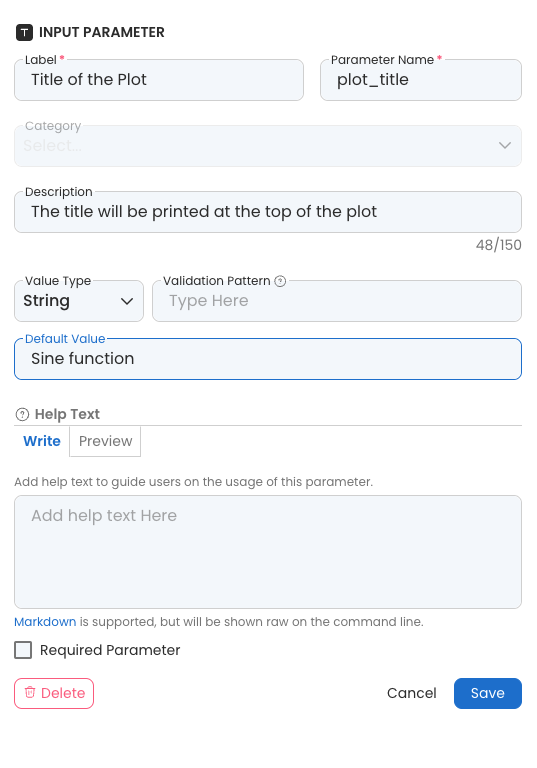

---
metaLinks:
  alternates:
    - >-
      https://app.gitbook.com/s/PvA82xvbvyt7rVs0IKXN/app-panel-guide/passing-app-panels-parameters-to-the-script
---

# Passing App Panel's Parameters to the Script

When running a Capsule in Code Ocean, the system looks for and executes the Run file. The Run file is a bash script that can be auto-generated by the system and modified manually afterward.&#x20;

For example, the screenshot below shows the Run script of a sample file provided by Code Ocean.

<figure><figcaption></figcaption></figure>

The Run script is auto-generated and it calls the `main.R` on line 8 with the `"$@"` parameter, which indicates to pass all the parameters to the script.

The way to access the parameters as command-line arguments in the main script can vary, depending on the programming language and the method of the parameter.&#x20;

## Named Parameters

In addition to the label of the Named Parameter, these parameters can also be named.  This name will be recognized in the Capsule code, and defaults can be set directly in the App Builder, eliminating the need for a config file to parse the App Panel input.&#x20;

The name of the parameter is indicated in the \[brackets]. Below, an example parameter is named `plot_title`. &#x20;

<figure><figcaption></figcaption></figure>

The Named Parameter version of the sample script for Python with comments for the purpose of each step is below. See Python's [Argparse Tutorial](https://docs.python.org/3/howto/argparse.html) for more details.

<pre class="language-python"><code class="lang-python">```python
    import argparse

    # create a parser object
    parser = argparse.ArgumentParser()
    
    # add the corresponding parameters
    parser.add_argument('--plot_title', dest='plot_title')
    parser.add_argument('--cycles', dest='cycles')
    parser.add_argument('--input_data', dest='input_data')
    
    # return the data in the object and save in args
    args = parser.parse_args()
    
    # retrive the arguments
<strong>    plot_title = args.title
</strong>    cycles = int(args.cycles)
    input_data = args.input_data
```
</code></pre>

## Order Parameters

Ordered Parameters are selected by default. In this method, the arguments will be passed in order. All the sample scripts accommodate this method and can be easily modified to fit your script.&#x20;

From the above example, the command in R for accessing the command line arguments is in line 5. It reads all the arguments and saves it in the `args` variables to access later  in line 9 to line 11.

In the App Builder section, the number of the order of the parameter is indicated within the parentheses ().


Try out sample files with different programming languages or examine Capsules in the Code Ocean Apps Library to learn how to use the command line arguments.

For example, in Python, you need can `import sys` and access the argument with `sys.argv`.

