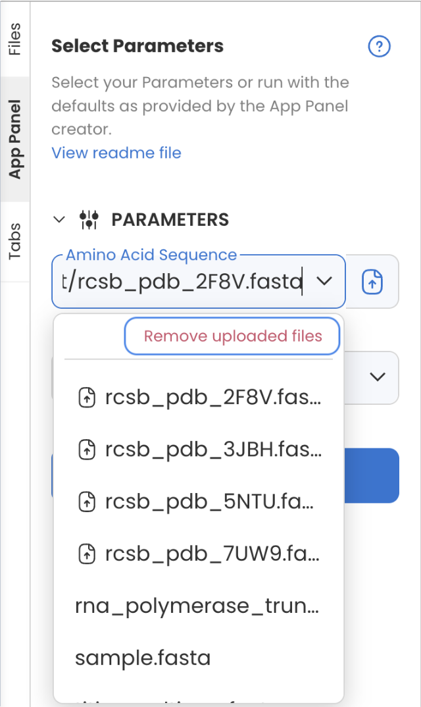

---
metaLinks:
  alternates:
    - >-
      https://app.gitbook.com/s/PvA82xvbvyt7rVs0IKXN/app-panel-guide/viewer-guide
---

# Executing an App Panel Capsule

Running Capsule with Parameters is straightforward.  First, replace Data Assets, set the parameters, then click Run.&#x20;

## Replacing Default Data Assets

Here is the field to add Data Asset to the Capsule for the run. The description is set by the author who built the App Panel with default Data Assets.

You can click on **Replace Data** to run with your own Data Asset.&#x20;

<figure><figcaption></figcaption></figure>

## Bulk Deleting Uploaded Files

In the data field, all uploaded files will appear in a dropdown list. to remove these files, select **Remove uploaded files.**

<figure><figcaption></figcaption></figure>

## Filling in Parameters and Running the Capsule

Set each parameter or use the defaults. When running a Capsule in the No-Code App release mode, the Run button will appear in the App Panel side panel.

<figure><figcaption></figcaption></figure>

When running an App Panel Capsule in the Standard release mode, the Reproducible Run on the top right will become Run with Parameters indicating the run will use the parameters assigned from the App Panel.

<figure><figcaption></figcaption></figure>

## Viewing Parameter Values of Runs in the Timeline

For any completed Capsule or Pipeline run that includes parameters, open the run menu in the Timeline and click **Parameter Values** to open a pop up window of all App Panel Data and Parameters used in the run.&#x20;

Click the clipboard icon to copy all values to your clipboard and click the pushpin icon to pin the window to the screen.

 

## Applying Parameter Values from a Previous Run to the App Panel

For previous runs completed in the UI, click "**Apply to App Panel**" to quickly apply these previous parameter values to the current App Panel.

<figure><figcaption></figcaption></figure>


The **Apply to App Panel** feature does not apply to Data or File parameters. Additionally, the button will not exist for runs initiated via API, runs created prior to the release of this feature in v4.0, and in cases where the App Panel parameters have been change significantly.


