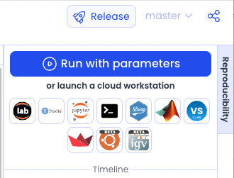

---
metaLinks:
  alternates:
    - >-
      https://app.gitbook.com/s/PvA82xvbvyt7rVs0IKXN/cloud-workstation/launching-a-cloud-workstation
---

# Launching a Cloud Workstation

To launch a Cloud Workstation, click the relevant IDE (integrated development environment's) icon in the **Reproducibility Panel** of your Capsule.

<figure><figcaption></figcaption></figure>


When launching a Cloud Workstation, the appropriate IDE package is added to the Cloud Workstation's environment if it has not already been installed. For example, the system will add `jupyterlab` to the conda package manager when starting a JupyterLab session.


### Cloud Workstation Computational Process Window&#x20;

The Computational progress feature details the system steps when launching or exiting a Cloud Workstation. The **Computational Process Window** will also display performance optimizing tips, providing suggestions for improving your Capsule.

<figure><figcaption></figcaption></figure>


When launching a Cloud Workstation, it is possible to continue working in the system by using the side navigation bar to reach any of the Code Ocean dashboards.&#x20;

