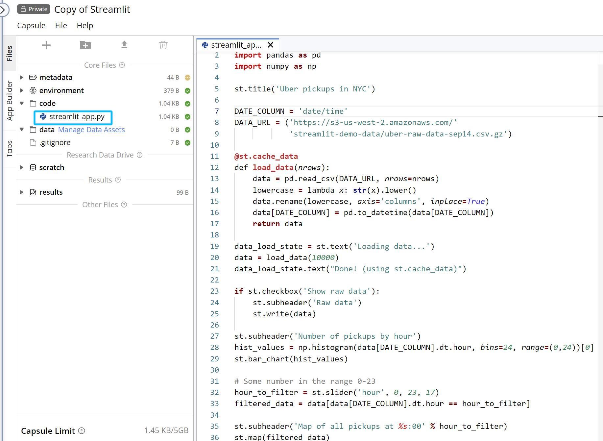

---
metaLinks:
  alternates:
    - >-
      https://app.gitbook.com/s/PvA82xvbvyt7rVs0IKXN/cloud-workstation/launching-a-cloud-workstation/running-streamlit-in-code-ocean
---

# Running Streamlit in Code Ocean

Interactive web applications can be created and shared in Python with the **Streamlit Cloud Workstation**.

<figure><figcaption></figcaption></figure>

To automatically run a Stremlit app in the Cloud Workstation, create a `streamlit_app.py` file and follow Streamlit's language conventions.

<figure><figcaption></figcaption></figure>

To run the app in the web browser, run the Streamlit Cloud Workstation.

<figure><figcaption></figcaption></figure>

If a `streamlit_app.py` is not present in your Capsule's `/code` folder, an error will occur when attempting to access the **Streamlit Cloud Workstation**.

<figure><figcaption></figcaption></figure>
