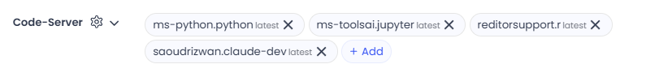

---
metaLinks:
  alternates:
    - >-
      https://app.gitbook.com/s/PvA82xvbvyt7rVs0IKXN/cloud-workstation/launching-a-cloud-workstation/using-vs-code-in-code-ocean
---

# Using VS Code in Code Ocean

VS Code (Visual Studio Code) is a popular programming IDE offering versatile options for development, code editing, and plugin extensions. Within Code Ocean, VS Code serves as a flexible workstation capable of running and debugging a wide range of programming languages and applications. A web server version of VS Code is available in your Capsule.

No specific Starter Environment is required. If VS Code is not already installed in your Capsule's Starter Environment, it will be automatically installed when the Cloud Workstation is launched.

## Launching a VS Code Cloud Workstation

To launch the web server VS Code version in your Code Ocean Capsule, click the VS Code icon in the Cloud Workstation panel.

<figure><figcaption></figcaption></figure>

Upon startup, you will see the VS Code dashboard, where you can begin development and editing.

<figure><figcaption></figcaption></figure>

## Using Extensions in the VS Code Cloud Workstation

The power of VS Code lies in its extensive ecosystem of extensions, which enhance programming language support, debugging capabilities, and overall functionality.

### Pre-Installed Extensions

The VS Code Cloud Workstation comes with pre-installed extensions to optimize the development experience. These extensions enhance productivity by supporting Python, R, and Jupyter workflows, providing syntax highlighting, and enabling AI-assisted coding with Cline.

The following extensions are pre-installed with their latest versions:

* **Python**: `ms-python.python`
* **R Support**: `REditorSupport.R`
* **Jupyter**: `ms-toolsai.jupyter`
* **Cline**: `saoudrizwan.claude-dev`

Access these extensions by navigating to the Extensions view in VS Code or using their features directly within the editor. For more information on working with Cline in VS Code, refer to our [Agents Guide](../../aqua-and-agents-guide/cline.md).&#x20;

### Download from Marketplace

Extensions can also be downloaded directly from the toolbar during an active Cloud Workstation session.

<figure><figcaption></figcaption></figure>


Installing extensions in this manner will persist for the **currently active** Cloud Workstation session  only, and will not remain installed once the Cloud Workstation is shut down.


## Adding Persistent VS Code Extensions to a Capsule Environment

### Install VS Code Extension via postInstall

To make VS Code extensions persist across Cloud Workstation sessions, they must be installed via the Capsule's `postInstall` script. This ensures that extensions are automatically installed whenever the VS Code Cloud Workstation is launched. To add extensions to the `postInstall` script, follow these steps:

1.  **Create the** `postInstall` **Script**

    1.  Click **Edit Post-Install Script** at the bottom of the **Environment Editor** to create the `postInstall` file in the `/environment` folder.<br>

        <figure><figcaption></figcaption></figure>
    2. You should now be able to navigate to the `postInstall` file in the `/environment` folder which for now is an empty bash script where you can add commands to configure your persistent extensions.<br>

    <figure><figcaption></figcaption></figure>
2. **Find the Extension ID**
   1. To add extensions, you must have the ID of the extension. For example, to add the Python extension for VS Code, follow the steps below.&#x20;
   2.  Visit the[ VS Code Marketplace](https://marketplace.visualstudio.com/vscode) and search for the desired extension. The webpage for the extension will display as below:<br>

       <figure><figcaption></figcaption></figure>
   3. On the extension's page, open the **Overview** tab and scroll down to **More Info**. Note the **Unique Identifier** of the extension. In this example the Python extension has the identifier `ms-python.python`.
3. **Add the Extension to the Capsule's**`postInstall`
   1. Insert the following code block into the `postInstall` script, replacing `ms-python.python` with the unique identifier of your extension:

```bash
if code-server --disable-telemetry --version; then
if [ ! -d "/.vscode/extensions" ]
    then
       echo "Directory /.vscode/extensions DOES NOT exists."
       mkdir -p /.vscode/extensions/
       fi
       
       code-server --disable-telemetry --extensions-dir=/.vscode/extensions --install-extension ms-python.python
       else
          echo "code-server not found"
       fi
```


If the extension's author is not verified on the VS Code marketplace, you may experience difficulties installing the extension.


Once your extensions have been added to the postInstall, they will automatically be installed upon launching the **VS Code Cloud Workstation** and available for use.

<figure><figcaption></figcaption></figure>

### Install VS Code Extension via Environment Editor

After a Capsule is run in the VS Cloud workstation, VS Code will be installed in the environment and the **Code-Server package manager** will be enabled. Any pre-installed extensions, such as those mentioned above, and any extensions installed during the Cloud Workstation session will appear here.&#x20;

<figure><figcaption></figcaption></figure>

The method for identifying package names and versions for the Code-Server package manager is different from the other package managers such as **pip** and **R(CRAN)**. For VS Code Extensions, there is no need to specify a version, and the package name is the Extension ID.

Please follow Step 2 in the above section ([Install VS Code Extension via postInstall](using-vs-code-in-code-ocean.md#install-vs-code-extension-via-postinstall)) to locate the Extension ID and add it to the Code-Server package manager. Leave the version as `latest`.

