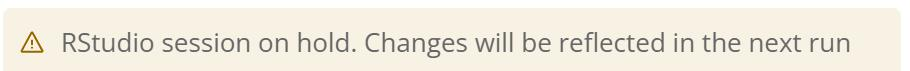

---
metaLinks:
  alternates:
    - >-
      https://app.gitbook.com/s/PvA82xvbvyt7rVs0IKXN/cloud-workstation/types-of-terminating-a-cloud-workstation
---

# Exiting a Cloud Workstation Session

There are two mechanisms to exit a Cloud Workstation (CW) session - **Hold** and **Shut Down**. Both options sync new content created in the Cloud Workstation back to the Capsule. The primary difference lies in how they handle session preservation and installed packages.

### Hold

* Retains all installed packages and folders created during the session.
* When you return to the session, you can resume working without reinstalling or recreating anything.

### **Shut Down**

* Does not preserve installed packages.&#x20;
* When the Cloud Workstation session is shutdown the system will display which packages were installed during the session and prompt you to add them to the Capsule's environment via the Package Managers.
  * If you want the packages available in the Cloud Workstation, you need to add them to the Capsule environment and rebuild the Capsule first.&#x20;

### Idleness Detection

After a period of idleness or low CPU (<5%) activity, the user will receive a UI notification asking if they wish to keep the session active. If there is no response, the Cloud Workstation will be placed on hold to prevent unnecessary resource consumption.&#x20;

The idle period for the deployment is configured by the admin. By default, this time is 2 hours.

If the admin has enabled the option to extend idle time, users will see a gear icon in the top-right corner of the Cloud Workstation bar. Clicking the gear will open **Cloud Workstation Settings**, where users can choose to increase the session's idle time by the amount set by the admin.&#x20;

<figure><figcaption></figcaption></figure>


The idle time extension applies only to the current session. Once the session ends, the idle time will reset to the default value.


## Hold and Resume a Cloud Workstation

When exiting a Cloud Workstation via **Hold**, the system will suspend the docker container from the Capsule. This will preserve all working spaces at the time when you leave the Cloud Workstation. The next time you access the Capsule, it will resume the Cloud Workstation session with all the command history, the files or folders you created, and the packages you installed in the previous session.


A Cloud Workstation on **Hold** will not save anything that would be lost when the kernel is shut down. This includes anything in memory (i.e., previously run Jupyter cells, etc.)



For reproducibility, it is strongly recommended to install packages using the [Environment Editor](../setting-up-the-environment/starter-environment.md).


To Exit a Cloud Workstation with Hold

1. Click the **Shut Down** button.&#x20;
2. Click **Hold** to return to the Capsule and close the Cloud Workstation. &#x20;
3.  After the Cloud Workstation is held, the system redirects you to the Capsule view.&#x20;

    On the Capsule dashboard, you can see the status of the Capsule is **'CW on hold'** when you hover over the Capsule.

.png>)

### Edit a 'CW on Hold' Capsule

You can edit a Capsule with a 'CW on Hold' status. You can add new files, execute a Reproducible Run, attach a secret and a Data Asset.&#x20;


You can add packages in the Environment Editor, but since the Cloud Workstation is on hold (the Docker container for the computation is on hold), the changes will be effective when the Docker container is rebuilt.&#x20;


### Resume or Discard a 'CW on Hold' Capsule

In the Capsule view under the Reproducible Run button, you can choose to either **Resume** or **Discard** a held Cloud Workstation.&#x20;

* **Resume**: Restores the Cloud Workstation to its previous state and allows you to continue the session.&#x20;
* **Discard**: Shuts down the Cloud Workstation, ending the session entirely.

<figure><figcaption></figcaption></figure>

### Collaborating on a Held Capsule

Collaborators with edit permissions can:

* View files synced from a held Cloud Workstation session.
* Resume the held Cloud Workstation to continue working from the previous session as shown below.

## Shut Down a Cloud Workstation

When exiting a Cloud Workstation via **Shut Down**, the system turns off the Docker container associated with the Capsule and syncs back all the content under the `~/capsule` directory, which includes the following folders:

* `/metadata`
* `/environment`
* `/code`
* `/data`
* `/scratch`
* `/results`

This means that it will not preserve any content created outside the "Capsule" folder, or any packages installed during the session. Installed packages will be suggested via a reminder in Package Suggestions, and you can choose to add them to the environment editor.


Content saved outside the `~/capsule` directory or within the `/results` folder will not be synced back to the Capsule and will be lost in future sessions.


**Note:** A Cloud Workstation can be shut down, or put on hold either directly from the Cloud Workstation or from the **Capsule Dashboard** as shown below

<figure><figcaption></figcaption></figure>

### Package Suggestions

The system detects new packages installed during your Cloud Workstation session. When you shut down the Cloud Workstation and return to the Capsule view, a reminder will appear indicating the new packages that were installed in the Cloud Workstation.&#x20;

To reproduce the environment that you created in the Cloud Workstation, review the package suggestions and add the appropriate packages to via the **Environment Editor**. Refer to [Package Managers and Adding Packages](../setting-up-the-environment/packages-and-package-manager.md) to learn more about installing packages in the Capsule view.

.png>)

## Behavior of a Capsule Upon Cloud Workstation Hold/Pause and Shutdown

<table><thead><tr><th>Capsule Component</th><th>Restored after Cloud Workstation termination</th><th>Restored after Cloud Workstation hold/pause</th><th data-hidden></th></tr></thead><tbody><tr><td>Changes made to files written to <code>/scratch</code>, <code>/code</code>, and <code>/data</code></td><td>✅</td><td>✅</td><td>code/data/scratch/results folder</td></tr><tr><td>Changes made to files written to <code>/results</code></td><td>❌</td><td>❌</td><td>Capsule Component</td></tr><tr><td>Data Assets attached in CW </td><td>✅</td><td>✅</td><td></td></tr><tr><td>Data Assets detached in CW </td><td> ✅</td><td>✅ </td><td></td></tr><tr><td>Occupied root volume</td><td>❌</td><td>✅</td><td> </td></tr><tr><td>Installed Packages</td><td>❌</td><td>✅</td><td>Environment </td></tr><tr><td>Loaded Packages (R)</td><td>❌</td><td>❌</td><td></td></tr><tr><td>Created virtual environments </td><td>❌</td><td>✅</td><td></td></tr><tr><td>Linux environment variables set </td><td>❌</td><td>❌</td><td>Code functions/commands</td></tr><tr><td>Variable values</td><td>❌</td><td>❌</td><td></td></tr><tr><td>Output of previous Jupyter cells </td><td>❌ </td><td>❌</td><td></td></tr><tr><td>R environment states/previously run lines </td><td>❌</td><td>❌</td><td></td></tr><tr><td>Unsaved changes written to R scripts</td><td>❌</td><td>
✅ 

<strong>Note</strong>: the version of the file is subject to change
</td><td></td></tr><tr><td>VSCode active debug sessions </td><td>❌</td><td>❌</td><td></td></tr><tr><td>Previous Actions in no-code app </td><td>❌</td><td>❌</td><td></td></tr><tr><td>VSCode - installed extensions</td><td>❌</td><td>✅</td><td>IDE</td></tr><tr><td>Preferences set in RStudio (Font size, theme color, etc.)</td><td>❌</td><td>✅</td><td></td></tr><tr><td>Preferences set in Jupyterlab (Dark/Light mode, UI Font size)</td><td>❌</td><td>✅</td><td></td></tr></tbody></table>

