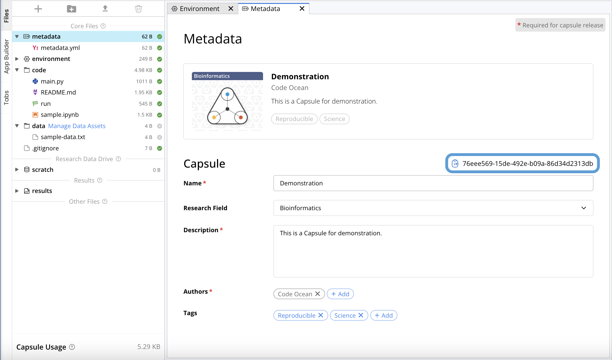

---
metaLinks:
  alternates:
    - https://app.gitbook.com/s/PvA82xvbvyt7rVs0IKXN/code-ocean-api/capsule
---

# Capsule

## Prerequisites

* Generated [Access Token](authentication.md) with Capsule scope
* The Capsule ID&#x20;

You can find the Capsule's ID in metadata.

<figure><figcaption></figcaption></figure>



*   <mark style="color:$success;">id</mark> `string`

    Capsule ID
* <mark style="color:green;">created</mark> `int64`\
  Capsule creation time
*   <mark style="color:green;">name</mark> `string`

    Capsule display name
*   <mark style="color:$success;">status</mark> `enum`

    Status of the Capsule&#x20;

    * <mark style="color:$success;">non\_release</mark>, <mark style="color:$success;">release</mark>
*   <mark style="color:green;">owner</mark> `string`

    Capsule owner’s ID
* <mark style="color:$success;">owner\_email</mark> `string`\
  Capsule owner's email address
*   <mark style="color:green;">slug</mark> `string`

    Alternate Capsule ID
*   <mark style="color:$success;">last\_accessed</mark> `int64`&#x20;

    Last time capsule was accessed by anyone
*   <mark style="color:$success;">description</mark> `string`

    Capsule description
*   <mark style="color:$success;">field</mark> `string`

    Capsule research field
*   <mark style="color:green;">original\_capsule</mark> `dictionary` (Optional)

    Original Capsule Info

    *   <mark style="color:$success;">id</mark> `string`

        Original Capsule id
    *   <mark style="color:$success;">major\_version</mark> `integer`

        Original Capsule major version
    * <mark style="color:$success;">minor\_version</mark> `integer` Original Capsule minor version
    *   <mark style="color:$success;">name</mark> `string`

        Original Capsule name
    *   <mark style="color:$success;">created</mark> `int64`

        Original Capsule creation data
    *   <mark style="color:$success;">public</mark> `boolean`

        Indicates whether the original Capsule is public
*   <mark style="color:$success;">release\_capsule</mark> `string` (Optional)

    Release Capsule ID
* <mark style="color:$success;">submission</mark> `dictionary` (Optional)&#x20;
  *   <mark style="color:$success;">timestamp</mark> `int64`

      Submission time
  *   <mark style="color:$success;">commit</mark> `string`&#x20;

      Submission commit hash
  *   <mark style="color:$success;">verification\_capsule</mark> `string`

      Verification Capsule ID
  *   <mark style="color:$success;">verified</mark> `boolean`

      Indicates whether the Capsule was verified
  *   <mark style="color:$success;">verified\_timestamp</mark> `int64`

      Verification time
*   <mark style="color:$success;">versions</mark> `dictionary` (Optional)

    Capsule versions

    *   <mark style="color:$success;">major\_version</mark> `integer`

        The Capsule major version
    *   <mark style="color:$success;">minor\_version</mark> `integer`

        The Capsule minor version
    *   <mark style="color:$success;">release\_time</mark> `int64`

        The version publishing time
    *   <mark style="color:$success;">doi</mark> `string`&#x20;

        Version DOI
* <mark style="color:$success;">tags</mark> `list<string>` (Optional)
*   <mark style="color:$success;">article</mark> `dictionary` (Optional)&#x20;

    Capsule article info

    *   <mark style="color:$success;">url</mark> `string`

        Article URL
    *   <mark style="color:$success;">id</mark> `string`

        Article ID
    *   <mark style="color:$success;">doi</mark> `string`&#x20;

        Article DOI
    *   <mark style="color:$success;">citation</mark> `string`

        Article citation
    *   <mark style="color:$success;">state</mark> `enum`

        Article state

        * <mark style="color:$success;">in\_review</mark>, <mark style="color:$success;">published</mark>
    *   <mark style="color:$success;">name</mark> `string`

        Article name
    *   <mark style="color:$success;">journal\_name</mark> `string`

        Articles journal name
    *   <mark style="color:$success;">publish\_time</mark> `int64`

        Article publish time
* <mark style="color:$success;">cloned\_from\_url</mark> `string`
  * URL to external Git repository linked to Capsule



## Get Capsule

<mark style="color:blue;">`GET`</mark> `https://{codeocean-domain}/api/v1/capsules/{capsule_id}`&#x20;

This API allows for the retrieval of the metadata for your Capsule.&#x20;

#### Path Parameters

| Name                                           | Type    |
| ---------------------------------------------- | ------- |
| `capsule_id`<mark style="color:red;">\*</mark> |  string |

**Scope**

| Type    | Permission |
| ------- | ---------- |
| Capsule | Read       |

<details>

<summary>Request Example Bash</summary>

```bash
curl https://{codeocean-domain}/api/v1/capsules/4bc97533-6eb4-48ac-966f-648548a756d2 \
  -u 'cop_d23dasd312':
```

</details>

<details>

<summary>Request Example Python SDK</summary>

```python
capsule = client.capsules.get_capsule(capsule_id="4bc97533-6eb4-48ac-966f-648548a756d2")
```

</details>

<details>

<summary>Response</summary>

[Capsule Object](capsule.md#capsule-object) &#x20;

</details>

## Delete Capsule

<mark style="color:$danger;">`DELETE`</mark> `https://{codeocean-domain}/api/v1/capsules/{capsule_id}`&#x20;

This API allows deletion of an archived capsule/pipeline.&#x20;

#### Path Parameters

| Name                                           | Type    |
| ---------------------------------------------- | ------- |
| `capsule_id`<mark style="color:red;">\*</mark> |  string |

**Scope**

| Type    | Permission |
| ------- | ---------- |
| Capsule | Write      |

<details>

<summary>Request Example Bash</summary>

```bash
curl -H "Content-Type: application/json" -u ${CUSTOM_KEY}: -X DELETE https://${co_domain}/api/v1/capsules/${capsule_id}
```

</details>

<details>

<summary>Request Example Python SDK</summary>

```python
delete_capsule = client.capsules.delete_capsule(capsule_id="242fa6b7-04dc-47f2-bdbc-5bc1e2c07feb")
```

</details>

<details>

<summary>Response</summary>

204 - No Content

* Returned upon successful deletion of the Capsule/Pipeline.

403 - Forbidden

* Returned in the following cases:
  * Target Capsule/Pipeline is not archived
  * User is not an either an owner of the Capsule/Pipeline or an Admin
  * Capsule/Pipeline has been Released

</details>

## Get Capsule App Panel

<mark style="color:blue;">`GET`</mark> `https://{codeocean-domain}/api/v1/capsules/{capsule_id}/app_panel`

#### Path Parameters

| Name                                           | Type    |
| ---------------------------------------------- | ------- |
| `capsule_id`<mark style="color:red;">\*</mark> |  string |

#### Request Body (optional)

| Name      | Type    | Description                                             |
| --------- | ------- | ------------------------------------------------------- |
| `version` | integer | Version of the release capsule, latest if unspecified.  |

**Scope**

| Type    | Permission |
| ------- | ---------- |
| Capsule | Read       |

<details>

<summary>Request Example Bash</summary>

```bash
curl -H "Content-Type: application/json" -u ${CUSTOM_KEY}: -X GET https://${co_domain}/api/v1/capsules/${capsule_id}/app_panel

```

</details>

<details>

<summary><strong>Request Example Python SDK</strong></summary>

```python
capsule_app_panel = client.capsules.get_capsule_app_panel(capsule_id="d73bbd72-c691-48fc-9996-a9b0f6a0f61c", version=2)
```

</details>

<details>

<summary>Response</summary>

*   <mark style="color:$success;">general</mark> (optional) &#x20;

    general information

    * <mark style="color:$success;">title</mark> `string` (optional) &#x20;
    * <mark style="color:$success;">instructions</mark> `string` (optional) &#x20;
    * <mark style="color:$success;">help\_text</mark> `string` (optional)&#x20;
*   <mark style="color:$success;">data\_assets</mark> `array` (optional) &#x20;

    input data assets

    * <mark style="color:$success;">id</mark>  `string` data asset ID
    * <mark style="color:$success;">mount</mark> `string` data asset mount within the capsule’s/pipeline’s `data` folder
    * <mark style="color:$success;">name</mark> `string` data asset name
    * <mark style="color:$success;">description</mark> `string` (optional) data asset description
    * <mark style="color:$success;">help\_text</mark> `string` (optional) additional help text
    * <mark style="color:$success;">kind</mark> - data assets type - `internal`, `external` or `combined`
    * <mark style="color:$success;">accessible</mark> - `boolean` - indicates whether the data asset is accessible to the user
* <mark style="color:$success;">categories</mark> `array` (optional) parameter categories (N/A for pipelines of capsules)
  * <mark style="color:$success;">id</mark> `string` category ID
  * <mark style="color:$success;">name</mark> `string` category name
  * <mark style="color:$success;">description</mark> `string` (optional) category description
  * <mark style="color:$success;">help\_text</mark>  `string` (optional) additional help text
* <mark style="color:$success;">parameters</mark> `array` (optional) input parameters (N/A for pipelines of capsules)
  * <mark style="color:$success;">category</mark> `string` (optional) category id from the category list, in case parameters are divided into categories
  * <mark style="color:$success;">name</mark> `string` parameter label
  * <mark style="color:$success;">param\_name</mark> `string` (optional) parameter name
  * <mark style="color:$success;">description</mark> `string` (optional) category description
  * <mark style="color:$success;">help\_text</mark>  `string`  (optional) additional help text
  * <mark style="color:$success;">type</mark> `string` parameter type `text`, `list` or `file`
  * <mark style="color:$success;">value\_type</mark> `string` (optional) the type of the parameter value
  * <mark style="color:$success;">default\_value</mark>  `string` (optional) default parameter value
  * <mark style="color:$success;">required</mark> `boolean` (optional) indicates a required parameter
  * <mark style="color:$success;">hidden</mark> `boolean` (optional) indicates a hidden parameter
  * <mark style="color:$success;">minimum</mark> `float64` (optional) minimum numeric value
  * <mark style="color:$success;">maximum</mark> `float64` (optional) maximum numeric value
  * <mark style="color:$success;">pattern</mark> `string` (optional) value validation pattern
  * <mark style="color:$success;">value\_options</mark> `array` (optional) list of value options for `list` parameters
* <mark style="color:$success;">results</mark> `array` (optional) selected result files
  * <mark style="color:$success;">file\_name</mark> `string` result file name
* <mark style="color:$success;">processes</mark> `array` (optional) pipeline process names and their corresponding app panels (for pipelines of capsules only)
  * <mark style="color:$success;">name</mark> `string` process name
  * <mark style="color:$success;">categories</mark> `array` (optional) parameter categories
  * <mark style="color:$success;">parameters</mark> `array` (optional) input parameters

</details>

## List Capsule Computations

<mark style="color:blue;">`GET`</mark> `https://{codeocean-domain}/api/v1/capsules/{capsule_id}/computations`

This API allows for the retrieval of Computations from a Capsule.

#### Path Parameters

| Name                                           | Type    |
| ---------------------------------------------- | ------- |
| `capsule_id`<mark style="color:red;">\*</mark> |  string |

**Scope**

| Type    | Permission |
| ------- | ---------- |
| Capsule | Read       |

<details>

<summary>Request Example Bash</summary>

```bash
curl https://{codeocean-domain}/api/v1/capsules/4bc97533-6eb4-48ac-966f-648548a756d2/computations \
   -u 'cop_d23dasd312':
```

</details>

<details>

<summary>Request Example Python SDK</summary>

```python
computations = client.capsules.list_computations(capsule_id="zv082356-a032-1b97-90b0-f209b8728927")
```

</details>

<details>

<summary>Response</summary>

List of [Computation Object](computation.md#computation-object)

</details>

## Attach Data Assets

<mark style="color:green;">`POST`</mark> `https://{codeocean-domain}/api/v1/capsules/{capsule_id}/data_assets`

#### Path Parameters

| Name                                           | Type    |
| ---------------------------------------------- | ------- |
| `capsule_id`<mark style="color:red;">\*</mark> |  string |

#### Request Body

List of `DataAssetAttachParams`:

| Name                                   | Type   | Description                                  |
| -------------------------------------- | ------ | -------------------------------------------- |
| `id`<mark style="color:red;">\*</mark> | string | Data Asset ID                                |
| `mount`                                | string | <p>(Optional)</p><p>Folder to mount data</p> |

**Scope**

| Type       | Permission     |
| ---------- | -------------- |
| Capsule    | Read and Write |
| Data Asset | Read and Write |

<details>

<summary>Request Example Bash</summary>

```bash
curl -X POST https://{codeocean-domain}/api/v1/capsules/4367940-e863-4819-afbd-1b6b9f9b1256/data_assets \
   -u 'cop_d23dasd312': \
   -H 'Content-Type: application/json' \
   --data-raw '[
     {"id": "052b6c02-2b81-4eca-b064-5e886c806ebe"},
     {"id": "9378e12a-f349-4f07-8f4b-9e64b8b8b514"}
   ]'

```

</details>

<details>

<summary><strong>Request Example Python SDK</strong></summary>

```python
from codeocean.data_asset import DataAssetAttachParams

data_assets = [
    DataAssetAttachParams(id="1fa0c990-3b5c-402f-ab3c-00cac6eed21e"),
    DataAssetAttachParams(id="1az0c240-1a9z-192b-pa4c-22bac5ffa17b", mount="Reference"),
]        
        
results = client.capsules.attach_data_assets(
    capsule_id="zv082356-a032-1b97-90b0-f209b8728927",
    attach_params=data_assets,
)
```

</details>

<details>

<summary>Response</summary>

List of `DataAssetAttachResults`:

*   <mark style="color:green;">external</mark> `boolean`

    indicates whether the data asset is external
*   <mark style="color:green;">id</mark> `string`

    data asset ID
*   <mark style="color:green;">job\_id</mark> `string`

    for internal use
*   <mark style="color:green;">mount</mark> `string`

    name of folder to mount the data asset
*   <mark style="color:green;">mount\_state</mark> `string`

    for internal use
*   <mark style="color:green;">ready</mark> `boolean`

    data asset is attached and ready for use in capsule

</details>

## Detach Data Assets

<mark style="color:red;">`DELETE`</mark> `https://{codeocean-domain}/api/v1/capsules/{capsule_id}/data_assets`

This API detaches one or many Data Assets from a Capsule/Pipeline.

**Prerequisite**

Before using this API call, you may need AWS Cloud Credentials configured as Secrets or an Assumable Role, if you are using Data Assets from Cloud Sources.

#### Path Parameters

| Name                                           | Type    |
| ---------------------------------------------- | ------- |
| `capsule_id`<mark style="color:red;">\*</mark> |  string |

#### Request Body

List of Data Asset IDs to detach.

**Scope**

| Type       | Permission     |
| ---------- | -------------- |
| Capsule    | Read and Write |
| Data Asset | Read and Write |

<details>

<summary>Request Example Bash</summary>

<pre class="language-bash"><code class="lang-bash">curl -X DELETE https://{codeocean-domain}/api/v1/capsules/a4367940-e863-4819-afbd-1b6b9f9b1256/data_assets \
<strong>  -u 'cop_d23dasd312': \
</strong>  -H 'Content-Type: application/json' \
<strong>  --data-raw '[
</strong>    "4ec22934-d75f-4385-9c52-c8e593a4234c",     
    "052b6c02-2b81-4eca-b064-5e886c806ebe",
    "9378e12a-f349-4f07-8f4b-9e64b8b8b514"
  ]'
</code></pre>

</details>

<details>

<summary>Request Example Python SDK</summary>

```python
data_assets = [
    "1fa0c990-3b5c-402f-ab3c-00cac6eed21e",
    "1az0c240-1a9z-192b-pa4c-22bac5ffa17b",
]        
        
client.capsules.detach_data_assets(
    capsule_id="zv082356-a032-1b97-90b0-f209b8728927",
    data_assets=data_assets,
)
```

</details>

## Archive Capsule

<mark style="color:purple;">`PATCH`</mark> `https://{codeocean-domain}/api/v1/capsules/{capsule_id}/archive`&#x20;

This API allows for archiving of a capsule/pipeline.&#x20;

#### Path Parameters

| Name                                           | Type    |
| ---------------------------------------------- | ------- |
| `capsule_id`<mark style="color:red;">\*</mark> |  string |

#### Request Body (optional)

| Name      | Type | Description                                                             |
| --------- | ---- | ----------------------------------------------------------------------- |
| `archive` | bool | If true will archive the capsule/pipeline, otherwise will unarchive it. |

**Scope**

| Type    | Permission |
| ------- | ---------- |
| Capsule | Write      |

<details>

<summary>Request Example Bash</summary>

```bash
curl -H "Content-Type: application/json" -u ${CUSTOM_KEY}: -X PATCH https://${co_domain}/api/v1/capsules/${capsule_id}/archive
```

</details>

<details>

<summary>Request Example Python SDK</summary>

```python
archive_capsule = client.capsules.archive_capsule(capsule_id="242fa6b7-04dc-47f2-bdbc-5bc1e2c07feb", archive=True)
```

</details>

<details>

<summary>Response</summary>

204 - No Content

* Returned upon successful archive/unarchive of Capsule or Pipeline.

</details>

## Search Capsules/Pipelines

<mark style="color:green;">`POST`</mark> `https://{codeocean-domain}/api/v1/capsules/search`

<mark style="color:green;">`POST`</mark> `https://{codeocean-domain}/api/v1/pipelines/search`

This API allows for the searching of Capsules and Pipelines in your deployment.&#x20;

#### Request Body (all fields optional)

<table><thead><tr><th width="239">Name</th><th width="172">Type or Value</th><th>Description</th></tr></thead><tbody><tr><td><code>offset</code></td><td>int</td><td>Specifies the starting index for the search.</td></tr><tr><td><code>limit</code></td><td>int</td><td>Specifies how many items to return (up to 1000, defaults to 100).</td></tr><tr><td><code>next_token</code></td><td>string</td><td>Represents the token for the next page of results as provided in the previous response. If both <code>from</code> and <code>next_token</code> are set, the <code>from</code> parameter is ignored.</td></tr><tr><td><code>sort_order</code></td><td><code>asc</code>, <code>desc</code></td><td>Determines the result sort order. Must be provided with <code>sort_field</code>, otherwise ignored.</td></tr><tr><td><code>sort_field</code></td><td><code>created</code>, <code>name</code>, <code>last_accessed</code></td><td>Determines the field to sort by. Default when searching via <code>filters</code> is <code>name</code>. When searching via <code>query</code>, results are ordered by relevance to the query. </td></tr><tr><td><code>query</code></td><td><code>string</code></td><td>Determines the search query. Can be a free text or in the form of “<code>name:... tag:..</code>.”</td></tr><tr><td><code>ownership</code></td><td><code>created</code>, <code>shared</code></td><td><p>Search Capsules by ownership. <code>created</code> - Only Capsules created by the user.</p><p><code>shared</code> - Capsules shared with the user</p><p>** Defaults to all accessible, admins will have access to all Capsules in the system.</p></td></tr><tr><td><code>status</code></td><td><code>release</code>, <code>non_release</code></td><td>By default all are returned.</td></tr><tr><td><code>favorite</code></td><td>boolean</td><td>Search only favorite Capsules.</td></tr><tr><td><code>archived</code></td><td>boolean</td><td>Search only archived Capsules.</td></tr><tr><td><code>filters</code></td><td>list</td><td></td></tr><tr><td>     <code>key</code></td><td>string</td><td>Field key can be each of <code>name</code>, <code>description</code>, <code>tags</code>, any custom field key defined by the admin.</td></tr><tr><td>     <code>value</code></td><td></td><td>Field value to be included/excluded (optional).</td></tr><tr><td>     <code>values</code></td><td></td><td>Field values in case of multiple values (optional).</td></tr><tr><td>     <code>range</code></td><td></td><td>Field range to be included/excluded (only one of min/max must be set).</td></tr><tr><td>          <code>min</code></td><td>number</td><td></td></tr><tr><td>          <code>max</code></td><td>number</td><td></td></tr><tr><td>     <code>exclude</code> </td><td>boolean</td><td>Whether to include/exclude the field value.</td></tr></tbody></table>

#### Response

<table><thead><tr><th width="238">Name</th><th width="149">Type</th><th width="330">Description</th></tr></thead><tbody><tr><td>has_more</td><td>boolean</td><td>Indicates if there are more results.</td></tr><tr><td>next_token</td><td>number</td><td>Specifies the next page token for the next request.</td></tr><tr><td>results</td><td>array </td><td>Array of Capsules found.</td></tr></tbody></table>

<details>

<summary>Request Example Bash</summary>

```bash
curl -H "Content-Type: application/json" -u ${CUSTOM_KEY}: -X POST https://${co_domain}/api/v1/capsules/search --data-raw '{
"from": 0,
"limit": 2,
"sort_order": "desc",
"sort_field": "name",
"query": "name:my_capsule tag:my_tag",
"ownership": "created",
"status": "non_release",
"favorite": false,
"archived": false,
"filters": [
{"key": "description",
"value": "data exploration xyz",
"include": true}
]
}'
```

</details>

<details>

<summary>Request Example Python SDK</summary>

```python
from codeocean.capsule import CapsuleSearchParams

capsule_search_params = CapsuleSearchParams(
    limit=10,
    sort_order="desc",
    sort_field="name",
    ownership="private",
    status="non_release",
    archived=False,
    favorite=False,
    query="name:preprocessing tag:genomics" 
)

capsules = client.capsules.search_capsules(capsule_search_params)
```

</details>

<details>

<summary>Request Example Response</summary>

<pre class="language-bash"><code class="lang-bash">{
"has_more":true,
"next_token":"sometoken",
"results":[
<strong>   {
</strong>    "created":1728918784,
    "description":"data exploration xyz",
    "id":"68cc97f4-7472-44a9-a999-184d78182f1b",
    "name":"sine wave",
    "owner":"133192f3-7197-43ba-9570-ba0b85409396",
    "slug":"8678374",
    "status":"non_release",
    "tags":["python"]
   },
   {
    "created":1734446547,
    "description":"data exploration xyz",
    "id":"f4ef4233-ca0d-40e6-96df-8246fdc8c681",
    "name":"Get utilization metrics",
    "owner":"133192f3-7197-43ba-9570-ba0b85409396",
    "slug":"9292474",
    "status":"non_release"
    }
]
}
</code></pre>

</details>
