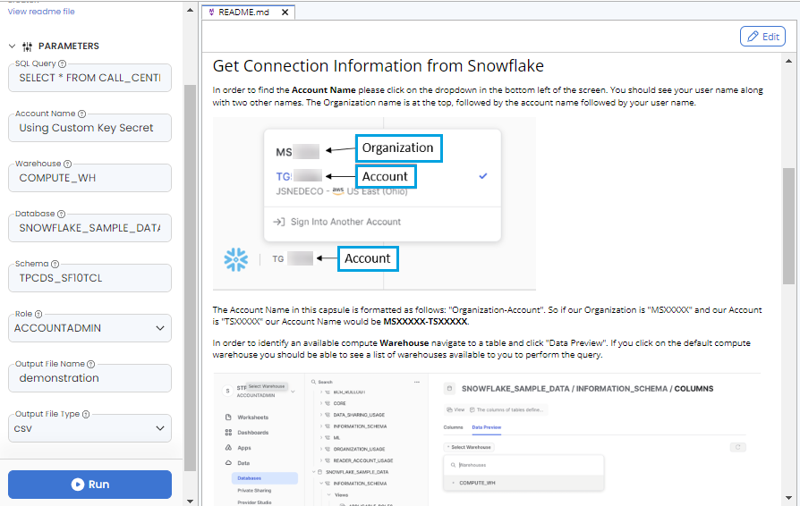

# Data Connector Example

[Data Connectors](../data-connectors.md) are a convenient way to get Data from External Sources (i.e., data lakes) into Code Ocean. Each Data Connector consists of two Capsules, one which performs a query and outputs a data file (in parquet, text, or other tabular formats) and the other will create a Data Asset automatically. After duplication, a user can use the Data Asset Generation Capsule and create Data Assets from SQL queries without any extra steps.&#x20;

### Data Connector Setup

1. Go to the Apps Library on your Dashboard.
2. Search and Duplicate **Snowflake - Data Connector** and **Snowflake - Data Asset Generation** into your deployment.
3. In the **Snowflake - Data Connector** Capsule, add your Database Credentials and Custom Key to the Capsule as [secrets](../../compute-capsule-basics/secret-management-guide/). See README file for information on how to find the Account in Snowflake.

<figure><figcaption></figcaption></figure>

<figure><figcaption></figcaption></figure>

<figure><figcaption></figcaption></figure>


AWS Data Connectors can use [Assume Roles ](../../pipeline-guide/components-of-a-pipeline/pipeline-settings.md#aws-iam-role)rather than user secrets to establish credentials.


3. Run a query using the **Snowflake - Data Connector** from the App Builder. The README provides instructions for retrieving the Warehouse, Database, Schema, etc required to run the Capsule.

<figure><figcaption></figcaption></figure>

4. Go to the **Metadata** tab and copy the **Capsule ID**.

<figure><figcaption></figcaption></figure>

5. Go to the **Snowflake - Data Asset** **Generation** capsule.&#x20;
6. In the `/code/config.sh` file edit “co\_domain” with your own Code Ocean domain. Edit “snowflake\_query” to match the **metadata** for the **Snowflake - Data Connector** Capsule. If you expect your queries to take over an hour, adjust the “max\_execution\_time” accordingly.

<figure><figcaption></figcaption></figure>

8. Run a query on **Snowflake - Data Asset Generation** from the App Builder using the same connection information as in the **Snowflake - Data Connector** Capsule.&#x20;
   * Edit the Data Asset parameters as needed.
9. Check your Data Assets for the results of your query.
