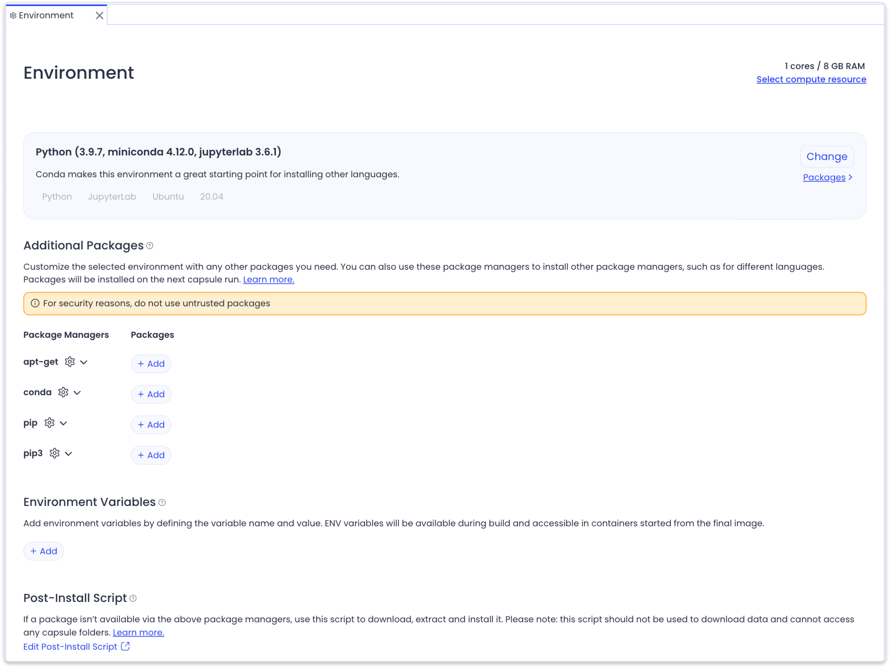

---
metaLinks:
  alternates:
    - >-
      https://app.gitbook.com/s/PvA82xvbvyt7rVs0IKXN/compute-capsule-basics/structure-of-a-compute-capsule/environment
---

# Environment

The Environment encompasses all software and compute resources configured for a Capsule. It is set up in the **Environment Editor** and stored in the `/environment` folder of the Capsule.&#x20;

* The `/environment` folder is invisible during a Reproducible Run, but can be accessed via any of the Cloud Workstations.

## Environment Editor

The **Environment Editor** allows you to configure and customize your Capsule's environment. Key functionalities include:

* **Selecting Compute Resources:** Define the number of CPU cores, memory, and specific instance type.
* **Choosing a Starter Environment:** Specify the foundational software in the Capsule by selecting a Starter Environment or copying an environment from an existing Capsule.
* **Adding Packages:** Install supplementary packages through integrated Package Managers.
* **Setting Environment Variables:** Configure custom variables to be used during Capsule execution.
* **Creating a Post Install Script:** Use the `postInstall` to add packages requiring special installation steps.

<figure><figcaption></figcaption></figure>

Steps on configuring the environment can be found in the [Setting up the Environment](../../setting-up-the-environment/) guide.&#x20;
