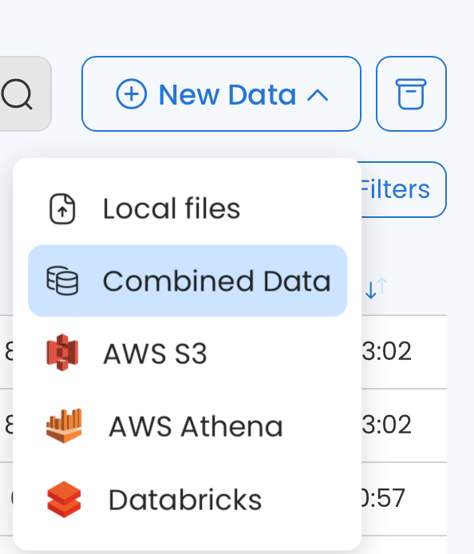
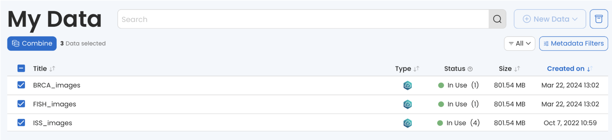
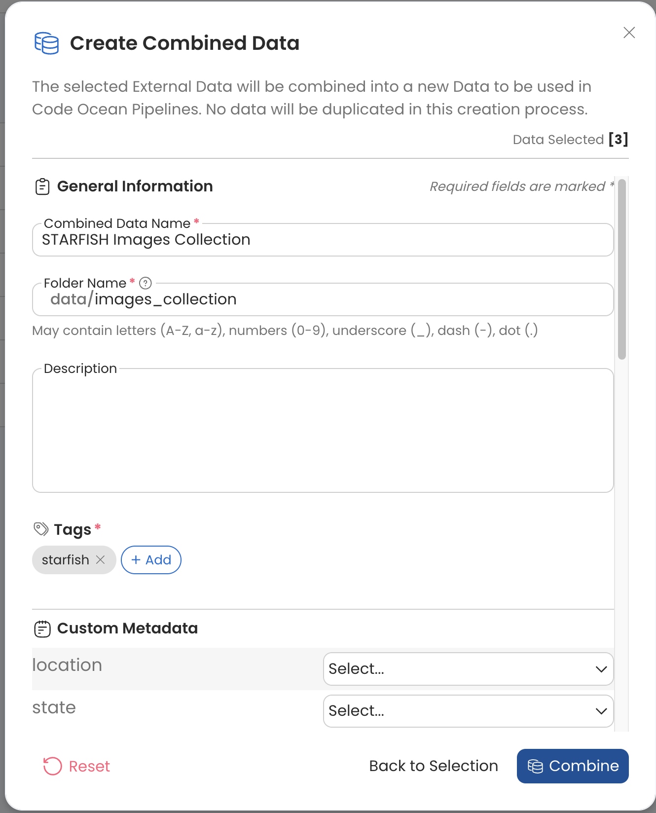

# Creating a New Data Asset

You can add a new Data Asset from the **My Data** page or from a Capsule/Pipeline:




1. Navigate to the **My Data** **Dashboard**.&#x20;
2. Click **+ New Data** to select a source.&#x20;

<figure><figcaption></figcaption></figure>



<table data-header-hidden><thead><tr><th width="121.66666666666666"></th><th></th><th></th></tr></thead><tbody><tr><td></td><td></td><td></td></tr><tr><td>1.</td><td>

Click on <strong>Manage</strong> near the <code>/data</code> folder in the Files panel. An <strong>Attach/Detach Data</strong> panel will appear from the side.
</td><td> </td></tr><tr><td>2.</td><td>

Click <strong>+ New Data</strong> to select a source. 
</td><td></td></tr></tbody></table>



After clicking a source, an interactive form will appear.


By default, a new Data Asset is private (i.e. only the owner can see it). To learn more about sharing a Data Asset with others, go to [Managing Data Assets](viewing-and-editing-data-assets/).&#x20;


## **Upload From Your Local Machine**

1. Click **+** **New Data**.
2. Choose **Local Files**.
3. Drag & drop the file or folders you want to upload from your local drive or click **Choose Files** to browse.
4. Complete the fields:
   * **Source Data Name** (required) — Use a meaningful name so that others can find the Data Asset easily.&#x20;
   * **Folder Name** (required) — The folder name inside a Capsule. Use a name that’s similar to the dataset name. Spaces and some special characters are not allowed here.
   * **Description** (optional) — Add markdown supported text to make the Data Asset easy to find and understand.
   * **Tags** (required) — Tags are another way to help people find your Data Asset.
   * **Custom Metadata** — These are administrator-defined fields for which you can provide values.
5. Click **Create Source Data** to finish.


You can upload a folder of files. The size limit for individual files is 5GB while there is no limit for the size of the folder. While there is no limit on the size of the folders, the upload timeout is 24 hours.

There is no "resume on failure" which means that if the upload is interrupted (due to a timeout or other issues), you will have to start the upload again.


## **Import From a Cloud Provider**

1. Click **+ New Data**.
2. Choose **AWS S3** or **Google Cloud** or a **Custom S3 Endpoint** and then click **Next**.
3. Provide information about the bucket you want to use.&#x20;
   * For AWS users, select **Import from S3 Bucket**. To add a remote Data Asset, read the next section: [Establish an External Link to an AWS S3 Bucket](adding-a-new-dataset.md#establish-an-external-link-to-aws-s3-bucket).
   * You can upload the entire bucket or a specific folder.&#x20;
   * For Private Buckets, if the Secret or Role is already in your Code Ocean account, the system will automatically use it to access the bucket. If there is no Secret or Role that provides access, you will be prompted to create a user secret (see [Secret Management Guide](../compute-capsule-basics/secret-management-guide/) if you need help creating a secret).
4. Complete the fields:
   * **Source Data Name** (required) — Use a meaningful name so that others can find the Data Asset easily.&#x20;
   * **Folder Name** (required) — The folder name inside a Capsule. Use a name that’s similar to the dataset name. Spaces and some special characters are not allowed here.
   * **Description** (optional) — Add markdown supported text to make the Data Asset easy to find and understand.
   * **Tags** (required) — Tags are another way to help collaborators find your dataset.
   * **Custom Metadata** — These are administrator-defined fields for which you can provide values.
5. Click **Create Source Data** to finish.


A single file can be specified in **Path** when creating an Internal Data Asset by importing from S3.&#x20;

**Note**: Do not include the trailing `/` in the Bucket Name or leading `/` in the Path.&#x20;

.png>)


## Import from a Data Connector

In addition to importing from AWS S3 and Google Cloud buckets, data can be imported from a variety of other external sources using the Data Connectors accessible via the **"New Data"** menu. These allow you to submit a query to the specified data source and automatically save the results as an Internal Data Asset. Details regarding using each of these Data Connectors are below.

<figure><figcaption></figcaption></figure>



Provide the required information and add any optional tags, custom metadata, etc. Below is an explanation of the required information specific to the AWS Athena Data Connector.

**Query**: This is the query that will run in AWS Athena to fetch your data. It's the results of this query which will be saved as a file in your new Data Asset.

**Temporary S3 Bucket**: AWS Athena requires an S3 Bucket to output the initial query results (referred to as OutputLocation in the Athena SDK).

**File Name**: The name you'd like to give the query output in your new Data Asset.

**File Type**: Select the file type for the output of the query.

**Select Secret**: This is the secret which will be used to access Athena and the temporary S3 output bucket.

<figure><figcaption></figcaption></figure>



Provide the required information and add any optional tags, custom metadata, etc. Below is an explanation of the required information specific to the Databricks Data Connector.


Connecting to Databricks requires creating a Databricks secret from the Account page.


**Query**: This is the query that will run in your specified Databricks SQL Warehouse to fetch your data. It's the results of this query which will be saved as a file in your new Data Asset.

**Workspace Hostname**: The "Server hostname" from your Databricks SQL Warehouse in the following format: dbc-xxxxxxxx-xxx.cloud.databricks.com\
\
**Port Number**: The port number configured for connecting to your Databricks SQL Warehouse.

**Endpoint HTTP Path**: The path to your Databricks SQL Warehouse. E.g. /sql/1.0/warehouses/0c7a8dff9ad0e63c

**Catalog**: Catalog name of the dataset you wish to query.

**File Name**: The name you'd like to give the query output in your new Data Asset.

**File Type**: Select the file type for the output of the query.

**Credentials**: Select the Databricks Secret you've set in your account page.

<figure><figcaption></figcaption></figure>


Your SQL Warehouse's Workspace Hostname, Port, Endpoint HTTP Path can be found by navigating to your SQL Warehouse in Databricks and opening the Connection Details as explained in the Databricks Documentation [here](https://docs.databricks.com/en/integrations/compute-details.html).\
\
You can find the "Catalog" by navigating to the Data page in your Databricks account, finding the dataset you wish to query, and copying the Catalog name.




## Establish an External Link to AWS S3 Bucket

1. Click **+ New Data**.
2. Click **AWS S3** and then click **Next**.
3. Specify the **Bucket Name** and the **Folder Name.**&#x20;
4. Select **Link to S3 Bucket**.
   * You can upload the entire bucket or a specific folder.&#x20;
   * For Private Buckets, if the Secret or Role is already in your Code Ocean account, the system will automatically use it to access the bucket. If there is no Secret or Role that provides access, you will be prompted to create a user secret (see [Secret Management Guide](../compute-capsule-basics/secret-management-guide/) if you need help creating a secret).
5. Complete the fields:
   * **Source Data Name** (required)—Use a meaningful name so that others can find the dataset easily.&#x20;
   * **Folder Name** (required)—The folder name inside a Capsule. Use a name that’s similar to the dataset name. Spaces and some special characters are not allowed here.
   * **Description** (optional)—Add markdown supported text to make the Data Asset easy to find and understand.
   * **Tags** (required)—Tags are another way to help collaborators find your dataset.
   * **Custom Metadata** — These are administrator-defined fields for which you can provide values.
6. Click **Create Source Data** to finish.


* To improve the traceability of Data Asset sources when created from an S3 bucket, there is a “Source” block in Data Asset details.&#x20;
* When viewing the contents of an imported/linked S3 bucket Data Asset, the original S3 bucket of the data source as well as the relative path to a subdirectory (if contents are not at the root of bucket) are viewable.



## Indexing an External Data Asset

External Data Assets are indexed upon creation and contents can be viewed in the Data Asset UI.

External Data Assets are available to be attached to a Capsule in a Cloud Workstation even if indexing has not fully completed.


External Data Assets may change and the current file view may not represent the latest content. If needed, simply re-index the External Data by clicking the button in the General section of Data details, to pull the latest changes.  &#x20;


<figure><figcaption></figcaption></figure>

## Create a New Data Asset from the Scratch Folder

To create a Data Asset from the `/scratch` folder in a Cloud Workstation:

1. From the dropdown list click **Create New Data Asset**.

2\.  Complete the fields:

* **Data Asset Name** (required)—Use a meaningful name so that others can find the dataset easily.&#x20;
* **Folder Name** (required)—The folder name inside a Capsule. Use a name that’s similar to the dataset name. Spaces and some special characters are not allowed here.
* **Description** (optional)—Add markdown supported text to make the Data Asset easy to find and understand.
* **Tags** (required)—Tags are another way to help people find your dataset.
* **Custom Metadata** — These are administrator-defined fields for which you can provide values.

## Combine Data Assets

To create a Combined Data Asset:

1. Click **+** **New Data**.
2. Choose **Combined Data**.

<figure><figcaption></figcaption></figure>

3. Check the box next to the External Data Assets you want to include in the Combined Data Asset.&#x20;
4. Click **Combine**.&#x20;

<figure><figcaption></figcaption></figure>

5. Complete the fields:

* **Combined Data Name** (required) — Use a meaningful name so that others can find the Data Asset easily.&#x20;
* **Folder Name** (required) — The folder name inside a Capsule. Use a name that’s similar to the dataset name. Spaces and some special characters are not allowed here.
* **Description** (optional) — Add markdown supported text to make the Data Asset easy to find and understand.
* **Tags** (required) — Tags are another way to help people find your Data Asset.
* **Custom Metadata** — These are administrator-defined fields for which you can provide values.

6. Click **Combine** to finish.

<figure><figcaption></figcaption></figure>

Once Created, you'll be able to see your Combined Data in the **My Data Dashboard**.

<figure><figcaption></figcaption></figure>


To run a Pipeline with a Combined Data Asset, [Assumable Roles](../pipeline-guide/components-of-a-pipeline/pipeline-settings.md#aws-iam-role) must be configured in your deployment by a Code Ocean admin.

