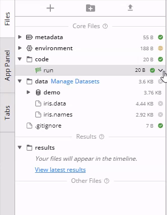

---
metaLinks:
  alternates:
    - >-
      https://app.gitbook.com/s/PvA82xvbvyt7rVs0IKXN/data-assets-guide/attaching-datasets-to-a-capsule
---

# Using Data Assets in a Capsule

## Attaching Data Assets to a Capsule

A single Data Asset can simultaneously be used by multiple users across many Capsules or Pipelines. This is possible because Data Assets are independent cloud storage.&#x20;

### From the IDE

1. Go to the data folder and click **Manage Data Assets**.
2. Attach/Detach Data side panel will appear. Click on the plus sign to attach the Data Asset.

<figure><figcaption></figcaption></figure>

If a Data Asset has been set as default in the App Builder, replace the Data Asset from the App Panel by clicking the replace button. &#x20;

<figure><figcaption></figcaption></figure>

### **From a Cloud Workstation** (e.g., RStudio, Terminal, or Jupyter)

1. Click **Manage Data** in the header of the Cloud Workstation.
2. Attach/Detach Data side panel will appear. Click on the plus sign to attach the Data Asset.

<figure><figcaption></figcaption></figure>


&#x20;When attaching an external Data Asset, the following points should be considered:

1. To link to an external Data Asset, you need to have an appropriate secret or Assumed Role in your Code Ocean account which grants access to the AWS S3 location. Code Ocean will automatically use the appropriate credentials to access the data without needing to explicitly add the secret or Assumed role to the Capsule environment.
2. Due to AWS S3 behavior, it takes time to reach files.


## Viewing the Detail of the Data Asset when attaching

&#x20;From the **Attach/Detach Data** page, metadata can be viewed without leaving the Cloud Workstation page.&#x20;

To retrieve this information:&#x20;

1. Hover over the data asset, which does not have to be attached
2. Click **Data Details**

<figure><figcaption></figcaption></figure>

While in the Cloud Workstation, the same Data information will display as on the Data dashboard.

After the Data Asset has been attached to the Capsule or Pipeline, you can find the Data details in the drop-down menu.

<figure><figcaption></figcaption></figure>

## Renaming **the Mounting Point (Folder)**&#x20;

After you have attached a Data Asset to your Capsule, you can change the name of the mounting point (that is, the folder name) in the Code Ocean IDE.

1. Hover over the attached dataset under the `/data` folder.
2. Click on the down arrow.
3. Select **Rename**.

