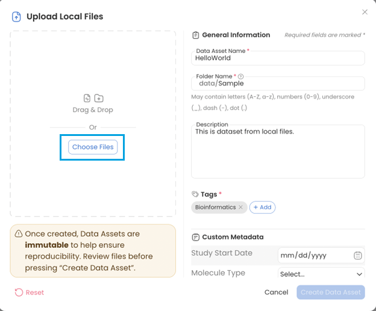
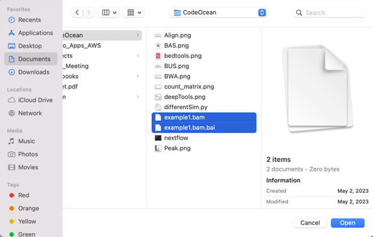
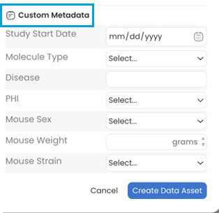
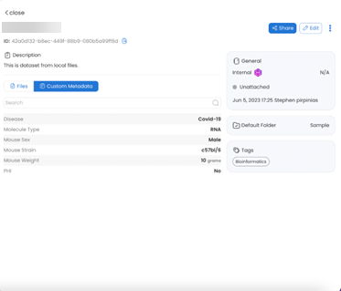

---
metaLinks:
  alternates:
    - >-
      https://app.gitbook.com/s/PvA82xvbvyt7rVs0IKXN/data-assets-guide/viewing-and-editing-data-assets/custom-metadata
---

# Custom Metadata

When creating a Data Asset, Custom Metadata can be added to make your data more findable and organized.

For example, when creating a Data Asset from **Local files**:

1. Click **+New Data**
2.  Select **Local files**\
    \
     

    <figure><figcaption></figcaption></figure>
3. Click **Choose Files.**

<figure><figcaption></figcaption></figure>

4. Select the files and click **Open** to add the file&#x73;**.**

<figure><figcaption></figcaption></figure>

5. Scroll to **Custom Metadata**.

<figure><figcaption></figcaption></figure>

The Custom Metadata Keys, Values, options, and Categories are managed by your Code Ocean Administrators. Reach out to them if changes are needed, or if additional options should be added.&#x20;

6. Scroll down to find **Categories**. Check the Category box if it is relevant to your Data Asset to expand the Keys inside. .png>)
7. Click **Create Data Asset** when all necessary fields have been populated.&#x20;

### To view the Custom Metadata

1.  Navigate to **My Data.**

    <figure><figcaption></figcaption></figure>

2. From the list, click the Data Asset to which the Custom Metadata was added.
3.  From the Data Details pane on the right side of the screen, click **Custom Metadata** to view the metadata.

    <figure><figcaption></figcaption></figure>
