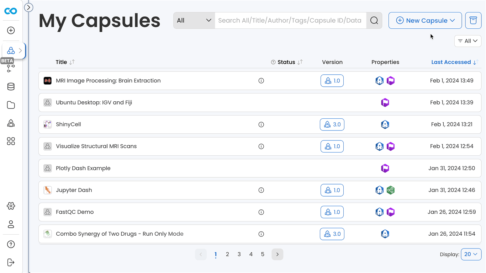
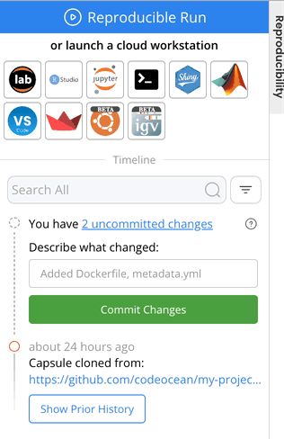
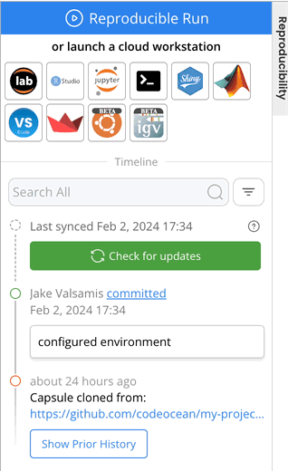
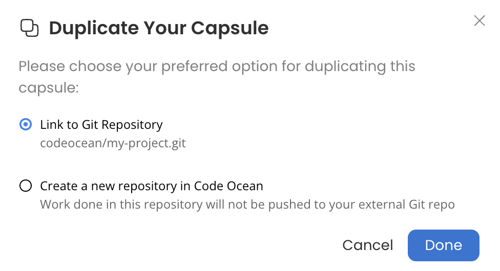
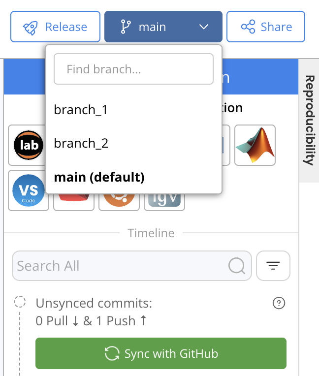

---
metaLinks:
  alternates:
    - >-
      https://app.gitbook.com/s/PvA82xvbvyt7rVs0IKXN/git-provider-integration-guide/github-integration-user-guide
---

# Using Git Provider Integration

1. [Create a Capsule by Cloning a Git Repository](github-integration-user-guide.md#create-a-capsule-by-cloning-a-git-repository)
2. [Committing and Syncing Changes](github-integration-user-guide.md#committing-and-syncing-changes)
3. [Concurrent Collaboration](github-integration-user-guide.md#concurrent-collaboration)
4. [Releasing a GitHub Integrated Capsule](github-integration-user-guide.md#releasing-a-github-integrated-capsule)
5. [Using Git Credentials](github-integration-user-guide.md#using-git-credentials)
6. [Connect an existing Capsule to a Git Provider](github-integration-user-guide.md#connect-an-existing-capsule-to-a-git-provider)


This section will show how to use GitHub integration in a Capsule, but the functionality is identical for Pipelines and for the other Git providers.&#x20;


## **Create a Capsule by Cloning a Git Repository**

1. Click **New Capsule** and select **Clone from Git**.
2. Enter the **HTTPS link** of the Git repo to clone.&#x20;

<figure><figcaption></figcaption></figure>


If the third option under **New Capsule** is **Clone from \<GitHub Organization>**, you will only be able to create Capsules by cloning repos from that GitHub organization.&#x20;


If the repo had a metadata, environment, code, or data folder, files in those folders will be stored under the corresponding directory in the Capsule. Otherwise all files will be stored in the "Other Files" section of the Capsule and can subsequently be reorganized.&#x20;

## Committing and Syncing Changes

New changes in the Capsule can be committed in the Capsule Timeline. After changes are committed, **Sync with GitHub** can be used to push changes to the GitHub repo.&#x20;

<figure><figcaption></figcaption></figure>

### Pulling Changes from GitHub

If changes to the repo have been made outside of the Capsule, **Check for updates** can be used to identify unsynced commits. **Sync with GitHub** can subsequently be used to pull any new commits from GitHub. &#x20;

<figure><figcaption></figcaption></figure>


If unable to successfully Sync with GitHub, there may be a conflict between the Capsule and repo. To display the full error message, launch a Cloud Workstation with access to the terminal and run `git push` to push changes manually.&#x20;


## Concurrent Collaboration

When developing a Capsule with a collaborator, only one person can edit the Capsule at once. Git Provider Integration provides the ability for collaborators to develop a project concurrently by working in multiple Capsules that are all linked to the same GitHub repo. This can be achieved by creating multiple Capsules by cloning the same GitHub repo, or by duplicating a GitHub integrated Capsule and choosing to "Link to Git Repository".&#x20;

### Duplicating a GitHub Integrated Capsule&#x20;

There are two options when duplicating a Capsule linked to a GitHub repo:

<figure><figcaption></figcaption></figure>

* **Link to Git Repository:** the new Capsule will be linked to the same GitHub repo.&#x20;
* **Create a new repository in Code Ocean:** the new Capsule will be independent of the source Capsule as it will have its own Git repo in Code Ocean's internal Git server.&#x20;

### Creating Branches

When developing a new feature or collaboratively developing a repo, it's a good practice to work on a new branch. If the GitHub repo has multiple branches, they will be available in the Capsule upon creation or after syncing with GitHub.

A new branch can be created in the Capsule by opening a Cloud Workstation with access to the terminal and running `git branch <new_branch_name>` to create the branch or `git checkout -b <new_branch_name>` to create the branch and immediately switch to it.

### Switching Branches

Switching between branches in a Capsule's Git repo can be done from the Capsule IDE.&#x20;

<figure><figcaption></figcaption></figure>

Once changes on a branch have been pushed, a pull request can be opened in GitHub and changes can be merged into the main branch.&#x20;


Merge conflicts can be resolved in GitHub.


## Releasing a GitHub Integrated Capsule

When you [release your Capsule](../release-capsules-and-pipelines/creating-and-using-release-capsules.md), the release version will be created from the main branch. A new Git repo is created for the release version within Code Ocean’s internal Git server. As new versions are released, commits are squashed so that there is one tagged commit per release version.

## Using Git Credentials

After adding Git credentials to the Account Page, they will automatically be available during runtime and during the environment build stage as the `GIT_ACCESS_TOKEN` environment variable.&#x20;

The existence of this variable enables the use of Git commands without providing credentials. This can be used to clone private Git repos for installation as part of the environment, as well as for convenient use of Git commands during a Cloud Workstation session.&#x20;

## Connect an existing Capsule to a Git Provider

If a Capsule wasn’t initially cloned from a GitHub repo, it’s still possible to link a Capsule to an external repo by importing the Capsule to GitHub and then creating a new Capsule from the repo. You can import a Capsule to a new Github repository by completing the following steps.

1.  Create an empty GitHub repo and follow the link to to import a repository.  

    <figure><figcaption></figcaption></figure>
2.  Complete the "Your source repository details" section using the information from your Code Ocean Capsule and account as shown below. 

    <figure><figcaption></figcaption></figure>

    1.  **The URL for your source repository:** This is the Code Ocean managed repository of the Capsule or Pipeline. Click on the Pipeline or Capsule drop-down menu in Code Ocean and select "clone via Git" to get the URL of its repository. 

        <figure><figcaption></figcaption></figure>
    2. **Your username for your source repository:** The email address you use to log in to Code Ocean.
    3. **Your access token or password for your source repository:** The access token from your Code Ocean Account page. If you haven't created one, you can do so by following [this guide](../code-ocean-api/authentication.md#to-create-an-access-token). This token only requires read permissions to Capsules and Pipelines. 

    You can then finish filling out the details on the page as you otherwise would when creating a new Github repository.

