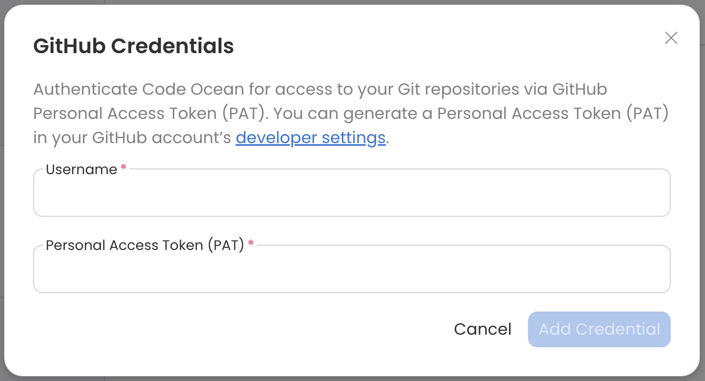
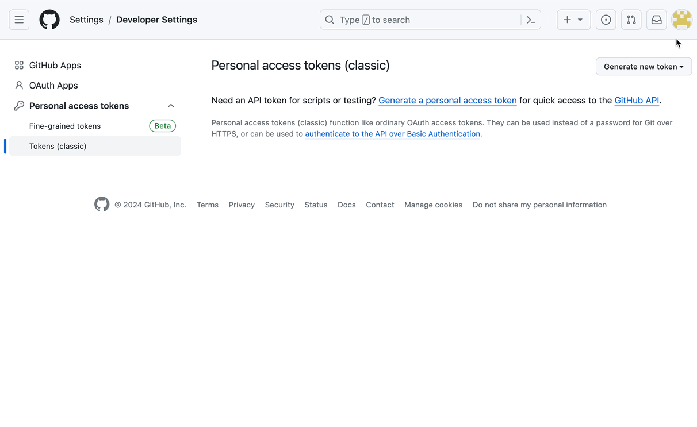
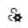

---
metaLinks:
  alternates:
    - >-
      https://app.gitbook.com/s/PvA82xvbvyt7rVs0IKXN/git-provider-integration-guide/setting-up-the-integration
---

# Setting up the Integration

## **Add Git Credentials**

In order to use the Git integration, you must first add credentials to your Account page in Code Ocean.&#x20;

1. Click the Account icon
2. From the **Credentials** screen click **+ Add Credentials**&#x20;
3.  Click **\<Git provider> Credentials**

    <figure><figcaption></figcaption></figure>
4.  Enter your **Git provider's username** and a **Personal Access Token (PAT)**. Click the developer settings link to visit the webpage where a PAT can be generated. See below for more information.&#x20;

    <figure><figcaption></figcaption></figure>


If **\<Git provider> Credentials** isn't an option under **+ Add Credentials**, please ask your Code Ocean admin to configure Git provider integration from the Admin Dashboard.


## **Generate a Personal Access Token (PAT) for Code Ocean**

Follow the steps below to generate a PAT in your Git provider's account. Note that the exact process varies depending on the Git provider, but the objective is to retrieve the token from the Git provider and add the token to your Code Ocean account.



### Creating a GitHub Personal Access Token 

1. In the upper-right corner of the page, click your profile photo, then click **Settings**.
2. In the left sidebar, click **Developer settings**.
3. In the left sidebar, click **Personal access tokens**, select **Tokens (classic)**.
4. Click **Generate new token**, select **Generate new token (classic)**.
5. Fill out the form and check the **repo** box for the scope.


For more information about how to generate a GitHub PAT, read this [article from GitHub](https://docs.github.com/en/github/authenticating-to-github/creating-a-personal-access-token).




### Creating a GitLab Personal Access Token

You can create as many personal access tokens as required.

1. In the top-right corner, select your avatar.
2. Select **Edit profile**.
3. On the left sidebar, select **Access Tokens**.
4. Enter a name and optional expiry date for the token.
5. Select the [desired scopes](https://docs.gitlab.com/ee/user/profile/personal_access_tokens.html#personal-access-token-scopes).
6. Select **Create personal access token**.


For more information about how to generate a GitLab PAT, read [this article from Gitlab](https://docs.gitlab.com/ee/user/profile/personal_access_tokens.html).




### Creating a Bitbucket App Password (equivalent to a PAT)

1. In the top right corner, select the Settings cog.&#x20;
2. Select **Personal Bitbucket Settings**. &#x20;
3. In the left menu bar, select **App passwords**.&#x20;
4. Click **Create app password** and select at least read and write repository permissions.
5. Select **Create** to generate the access token.&#x20;

<figure><figcaption></figcaption></figure>


For information about how to generate a Bitbucket PAT ("App Password"), read [this article from Bitbucket](https://support.atlassian.com/bitbucket-cloud/docs/create-an-app-password/).




### Creating an Azure DevOps Personal Access Token

1. Sign in to your Azure DevOps organization.
2. Open User Settings by clicking the  icon in the top right of the screen and select **Personal access tokens**. 

<figure><figcaption></figcaption></figure>

3. Select **+ New Token**.
4. Complete the required fields and choose the appropriate scope for the token.


For more information about how to generate an Azure DevOps PAT, read this [article from Azure DevOps](https://learn.microsoft.com/en-us/azure/devops/organizations/accounts/use-personal-access-tokens-to-authenticate?view=azure-devops\&tabs=Windows).





**Note:** If the email address you used to create your Code Ocean account does not match the email address associated with the GitHub account you've linked, commits will appear in GitHub as being created by a generic user with your Code Ocean user name. If you'd like commits from Code Ocean to appear in GitHub as being created by your linked GitHub account, you can simply add the email address used to create your Code Ocean account as an additional email address in your GitHub account by following this [guide from GitHub](https://docs.github.com/en/account-and-profile/setting-up-and-managing-your-personal-account-on-github/managing-email-preferences/adding-an-email-address-to-your-github-account).

