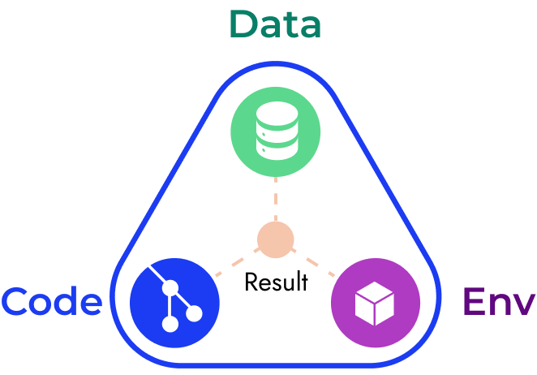
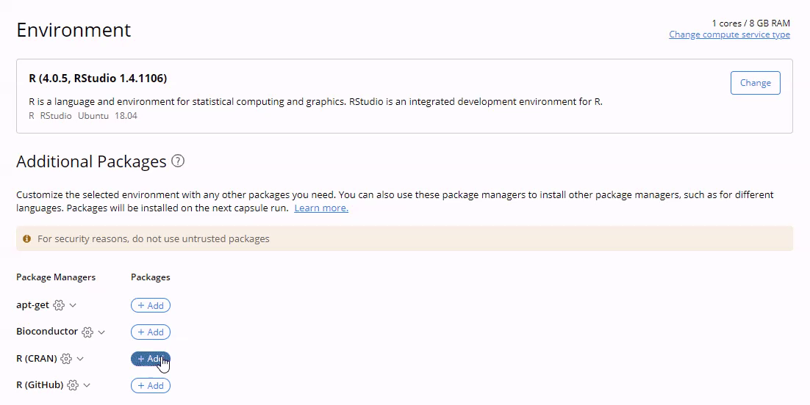
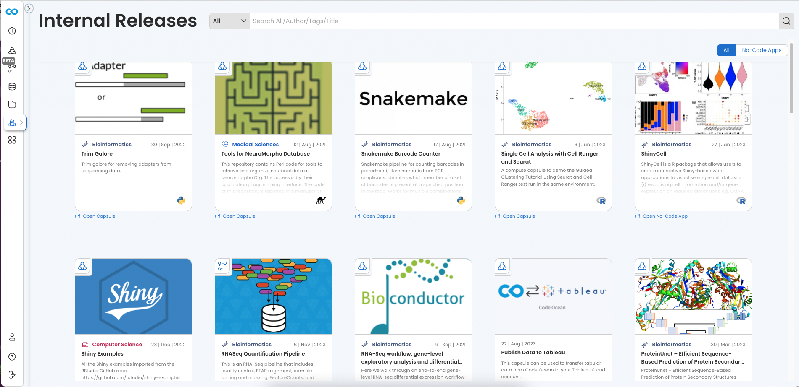
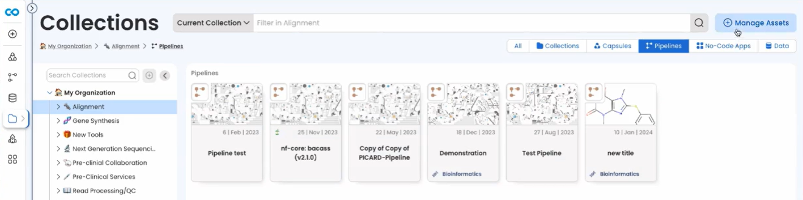
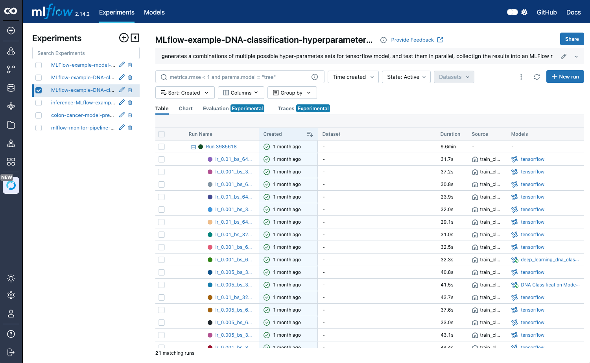

# Key Concepts

### Capsule

The foundational unit used to create, organize, and share projects in Code Ocean. The Capsule contains the code and all that is required for the code to run. This includes data, a specification of the environment, version of the operating system, packages, libraries, any artifacts that the code depends on, and the results.

Full documentation: [here](compute-capsule-basics/)

<figure><figcaption></figcaption></figure>

### Starter Environment

The base environment of a Capsule. This is the first thing to configure when setting up a Capsule's computational environment and will also determine if the Capsule can use GPU or CPU compute resources. Accessible in the Environment Editor by clicking the /environment folder the file tree of the Capsule.

Full Capsule environment documentation: [here](compute-capsule-basics/structure-of-a-compute-capsule/environment.md)

<figure><figcaption></figcaption></figure>

### Package Manager

For example: apt-get, conda, mamba, R CRAN, bioconductor, etc. Package Managers are automatically added to the Capsule Environment Editor based on the Starter Environment chosen for the Capsule. When a Custom Base Image is used, Code Ocean will automatically detect the appropriate package managers and make them available in the Environment Editor.

Every Code Ocean Recommended Starter Environment includes apt-get, the command–line tool for working with APT (Advanced Package Tool) software packages, as it is generally the preferred way to install packages in Linux distributions.

Full Capsule environment documentation: [here](setting-up-the-environment/packages-and-package-manager.md)

<figure><figcaption></figcaption></figure>

### Compute Resource: Flex and Dedicated

Flex resources are the default option for running your Capsule. Selecting this resource attempts to allocate the chosen compute capacity (slot) on a running worker machine such as EC2 instance, in your deployment's managed fleet of workers for each computation.

Choosing a dedicated resource will spin up a new Amazon EC2 instance exclusively for your computation. There are dedicated machines with a wide range of specifications, for example, CPUs from 0.5 GB RAM to 4,000 GB RAM, to ensure that there are always resources available to match your needs.

Full Compute Resource documentation: [here](setting-up-the-environment/compute-resources.md)

<figure><figcaption></figcaption></figure>

### Cloud Workstation

Well-known IDEs (integrated development environments) that can be launched from your Capsule with the selected Starter Environment and compute resources. For example: Code Server, Jupyter Lab, Jupyter Notebooks, RStudio, RShiny, Streamlit, Terminal.

Full Cloud Workstation documentation: [here](cloud-workstation/)

<figure><figcaption></figcaption></figure>

### Data Asset

The foundational object for working with data in Code Ocean. A single Data Asset can be shared multiple users or groups of users in your deployment and simultaneously be used by multiple users across many Capsules or Pipelines. Data Assets are accessible from the Navigation sidebar and can be added to Capsules and Pipelines from within their respective Data Asset menus.

**Internal Data Asset:** An immutable copy of a dataset stored in your Code Ocean VPC. Created by by [uploading data from a local machine](https://docs.codeocean.com/user-guide/data-assets-guide/adding-a-new-dataset#upload-from-your-local-machine) or [importing data from a cloud provider](https://docs.codeocean.com/user-guide/data-assets-guide/adding-a-new-dataset#import-from-a-cloud-provider).

**External Data Asset:** An external link to an S3 location. The dataset contents remain in their original location and no data is copied.

**Captured Result:** A Data Asset created from the output of a Capsule or Pipeline computation stored in your Code Ocean VPC.

**External Result:** A Data Asset created from the output of a Capsule or Pipeline computation stored in a specified S3 location outside of your Code Ocean deployment.

**Combined Data:** Data Assets created from two or more External Data Assets. Combined Data Assets can be used in Pipelines and allow you to parallelize at the level of Data Asset instead of at the level of the items within a single Data Asset.

Full Data Asset documentation [here](data-assets-guide/)

### Pipeline

A workflow created by stringing together a series of Capsules using the drag-and-drop Pipelines UI which automatically writes a nextflow script and runs on AWS batch CPUs/GPUs for parallelization of process execution.

Full Pipeline documentation: [here](pipeline-guide/)

<figure><figcaption></figcaption></figure>

### "Release" Capsule and Pipeline

A permanently reproducible, run-only version of your Capsule or Pipeline that is separate from the original. Releases enable your team to use a fully functioning, standardized version while you continue to develop your Capsule or Pipeline separately and new versions can be released as necessary. A Release Capsule or Pipeline that is shared with everyone is known as an "Internal Release" and will show up on the Internal Releases page accessible via the Navigation sidebar.

Full Release documentation: [here](release-capsules-and-pipelines/)

<figure><figcaption></figcaption></figure>

### Collection

Organized groups of Capsules, Pipelines, No-code Apps, and Data Assets, organized by Administrator-defined topics. They allow for better asset management at the organization level, increased discoverability, and re-use of “Gold Standard” assets. Collections have their own dashboard, accessible from the Navigation sidebar.

Full Collections documentation: [here](collections.md)

<figure><figcaption></figcaption></figure>

### Code Ocean Apps

Ready-to-use Capsules each of which can be duplicated into your deployment and used with or without customization as an individual Capsule and in Pipelines.

Full Code Ocean Apps documentation: [here](code-ocean-apps/)

<figure><figcaption></figcaption></figure>

### Models

Designed to facilitate the sharing and management of machine learning models in Code Ocean. Similar to Data Assets, Models are stored in independent cloud storage, and can be used across multiple Capsules or Pipelines.

Full Code Ocean documentation: [here](ml-flow/)

<figure><figcaption></figcaption></figure>

### Public API

The Code Ocean public API allows users to easily automate operations in Code Ocean such as: attaching Data Assets to a Capsule/Pipeline, running a Capsule/Pipeline, creating a Data Asset from the result with the appropriate metadata, and sharing it with the appropriate users.\
\
The Code Ocean API is organized around [REST](http://en.wikipedia.org/wiki/Representational_State_Transfer) and has predictable resource-oriented URLs. The API accepts and returns [JSON-encoded](http://www.json.org/) request bodies and responses, and uses standard HTTP response codes, authentication, and verbs.

There are two ways to use the Code Ocean API, directly and via our [Python SDK](https://github.com/codeocean/codeocean-sdk-python?tab=readme-ov-file). The Code Ocean Python SDK makes it easy to leverage the full functionality of the extensive Code Ocean Public API in your Python scripts and applications.

Full API documentation: [here](code-ocean-api/)

### User Budgets

If Admins have this feature enabled, users can go to their Account page and view their allocated monthly budget and current usage across all of their runs.&#x20;

<figure><figcaption>
Account
</figcaption></figure>
