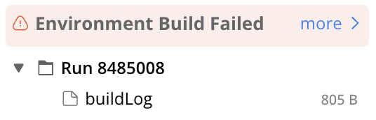
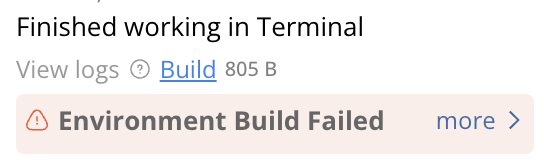

---
metaLinks:
  alternates:
    - https://app.gitbook.com/s/PvA82xvbvyt7rVs0IKXN/more-support
---

# More Support

Code Ocean is designed with a variety of features to seamlessly fit into different workflows, and we are here to assist you whenever you encounter challenges or have questions. As Code Ocean is built on AWS, some issues may stem from the integration between the Code Ocean application, AWS, or third-party elements such as packages or Git providers. Please explore this guide for potential solutions and troubleshooting tips.

To ensure a smooth support experience, please reach out to [support@codeocean.com](mailto:support@codeocean.com) using the following guidelines:

* Clearly outline the issue you're facing.
* Include relevant details about the Capsule or Pipeline, the AWS environment, or any third-party components involved.
* If applicable, share specific error messages or unexpected behaviors you've observed.
* Attach any relevant code snippets or configuration settings related to the problem.


Before contacting support, please try searching for relevant keywords in our User Guide to see if there is a solution provided.


## Screenshots and/or Recording

Please try to provide screenshots or recordings when you submit a support email. It helps us to fully understand the issue, reproduce it internally and narrow down the possible causes for a quicker solution.

## Link to the Capsule or Pipeline

Depending on your company's policy, you may involve a support engineer to look at your Capsule/Pipeline. Please include the link to it in your support email. To learn more about sharing Capsules and Pipelines, please refer to the [Managing Capsules](compute-capsule-basics/managing-capsules/) and [Managing Pipelines](pipeline-guide/managing-pipelines/) guides.

Sharing the Capsule/Pipeline link enables both your support engineer and our team to efficiently investigate or replicate the issue.

## Capsule, Pipeline, and Data Asset ID

If the issue is related to a specific Capsule, Pipeline, or Data Asset, providing the corresponding ID will assist in the support process. You can find the Capsule or Pipeline ID on the [metadata page](compute-capsule-basics/structure-of-a-compute-capsule/metadata.md#the-capsule-id), and the Data Asset ID in the [Data Details](data-assets-guide/viewing-and-editing-data-assets/#view-general-information).

## **Environment Setup Issue**

*   If the run failed during the environment building process, an error message "Environment Build Failed" will be displayed in your Timeline. This message is accompanied by a BuildLog, allowing you to review the environment building steps and identify the root cause of the error. To seek assistance from our team, please attach the BuildLog when reaching out.

* If you encounter these complications during a Reproducible Run, the associated message and [BuildLog](setting-up-the-environment/build-log.md) will appear in the timeline. By clicking on the BuildLog, you can examine the specific steps that went wrong and make necessary corrections. You can download the BuildLog and forward it to our support team if additional assistance is needed.

* Should you encounter an issue while executing the Cloud Workstation, you will see the following message. Click on Build to open the buildLog in the viewer. Right-click on Build and download if needed.


Environment setup failure may be attributed to dependency issues such as missing packages or conflicting versions. As these are not associated with Code Ocean, solutions for these issues can often be found by searching on platforms like Google or Stack Overflow.

Additionally, consider checking with your colleagues, especially if it may stem from shared packages that might not be installed universally.&#x20;

We encourage you to explore and attempt solutions from these sources as they often provide valuable insights and resolutions to common dependency challenges.


## Support Bundle

The support bundle, accessible in the Support tab within the Admin Panel, is a zip file that contains all the related AWS logs. It addresses system issues such as server downtime, malfunctioning worker machines, or unsuccessful API calls via the Code Ocean application integration.

If you are dealing with a simple use case issue, there's no immediate need to reach out to your Admin and request the support bundle. Instead, we recommend including your Admin in the ticket you've opened, and should the matter require additional details, we can coordinate to obtain the necessary information. Admins can learn how to generate a support bundle in the Admin guide.&#x20;

 
