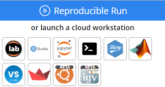

---
metaLinks:
  alternates:
    - https://app.gitbook.com/s/PvA82xvbvyt7rVs0IKXN/onboarding
---

# Onboarding

Welcome to Code Ocean! This section provides links to essential guides and tutorials so you can quickly get comfortable navigating and using the platform’s core functionality. Below, you’ll find overviews and links for each key component, providing everything you need to build, organize, and run your research workflows effectively.

Overviews of the top three functionalities you'll need to know to effectively work in Code Ocean as well as guidance for additional learning are below:

1. [Capsules](./#capsules)
2. [Working in a Cloud Workstation](./#working-in-a-cloud-workstation)
3. [Data Assets](./#data-assets)
4. [Where to go Next](./#where-to-go-next)

## **Capsules**

In Code Ocean, the unit used to create, organize, and share research projects is a Capsule. The Capsule contains the code and all that is required for the code to run. This includes data, a specification of the environment, version of the operating system, packages, libraries, any artifacts that the code depends on, and the results.&#x20;

You can learn more about Capsules in the full guide [here](../compute-capsule-basics/).



### **Working in a Cloud Workstation**

Within Capsules you can access well-known IDEs (integrated development environments) such as Code Server, Jupyter Lab, Jupyter Notebooks, RStudio, RShiny, Streamlit, Terminal and run them as you would locally but with the addition of all the reproducibility and ease of use functionality available in Code Ocean.

<figure><figcaption></figcaption></figure>

You can learn more about working in a Cloud Workstation in the full guide [here](../compute-capsule-basics/).

## **Data Assets**

Data Assets are the foundational object for working with data in Code Ocean. A single Data Asset can be shared multiple users or groups of users in your deployment and simultaneously be used by multiple users across many Capsules or Pipelines. Data Assets are accessible from the Navigation sidebar and can be added to Capsules and Pipelines from within their respective Data Asset menus.&#x20;

You can learn more in our Data Assets guide [here](../data-assets-guide/).



## Where to go Next

In addition to the detailed guides for each feature, there are a variety of materials available to help you familiarize yourself with Code Ocean and learn to use the system effectively.

* [Quick Start Guides](quick-start-guides/)
  * [Create a Capsule in 5 Minutes](quick-start-guides/create-a-capsule-in-5-minutes.md)
  * [Create a Pipeline in 5 Minutes](quick-start-guides/create-a-pipeline-in-5-minutes.md)
* [Video Library](video-library.md)
  * A collection of tutorials and demos to help new users familiarize themselves with the system and its primary functionality.
* [Key Concepts](../key-concepts.md)
  * An introduction to all key Code Ocean concepts and definitions in one page with links to further documentation.
