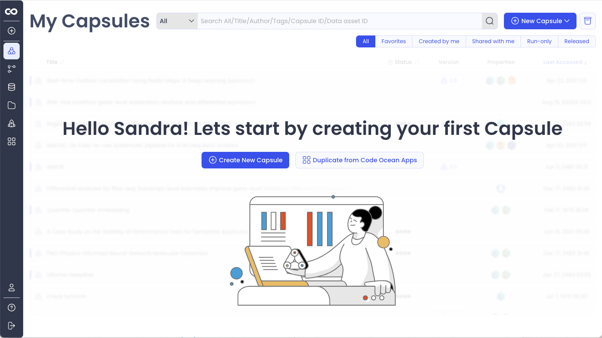
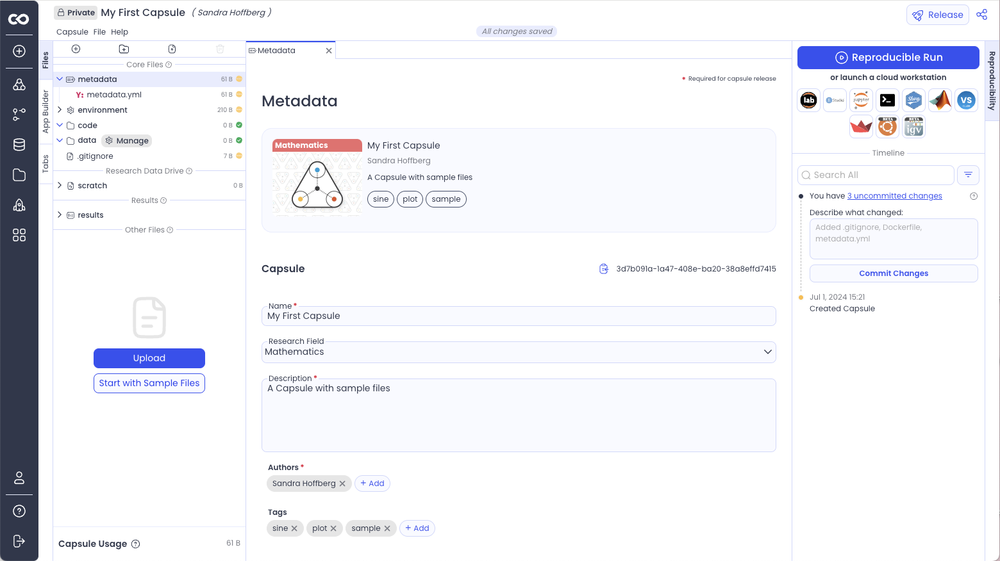
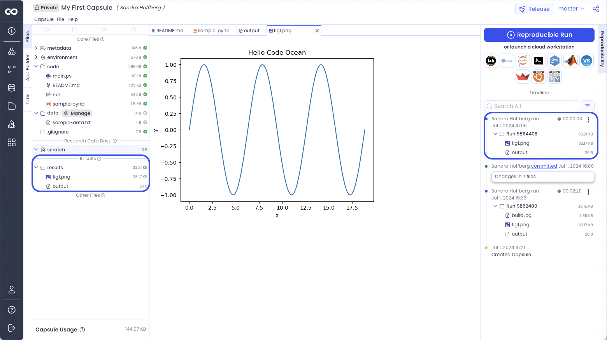
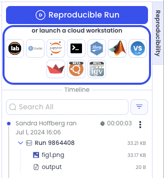

# Create a Capsule in 5 minutes

## Create a new Capsule

There are multiple ways to create a new Capsule:&#x20;

* From the Capsule Dashboard, Click **Create New Capsule** or **Duplicate from Code Ocean Apps** to get started by browsing pre-made Capsules from the Code Ocean team.  Alternatively, click ‘**+ New Capsule**’ in the top right corner.

<figure><figcaption></figcaption></figure>

* Click + on the left toolbar, and then **Create New** under New Capsule

<figure><figcaption></figcaption></figure>

## Become familiar with the Capsule structure

There are 3 panes in a Capsule

1. File Navigation and App Builder (Left)
   * The file tree contains Metadata, Environment, Code, Data, Scratch, and Results folders.
   * The App Builder allows you create an App Panel to interact with Capsules without modifying the code by passing arguments to the command line.
2. Editor (Center)
   * Edit Capsule files, including setting up the environment and modifying metadata.
   * View data and result files.
3. Reproducibility (Right)
   * Perform a Reproducible Run.
   * Launch a Cloud Workstation.
   * Manage changes to files via Git.
   * View results of previous runs and the history of the Capsule in the Timeline.

## Configuring the environment

Configure the environment by selecting the starter environment from the list of options, which is analogous to the type of machine to run.  The Python and R environment is a good choice for coding in these languages, or using Jupyter Notebook/Lab or RStudio.

<figure><figcaption></figcaption></figure>

To customize the environment, install packages using the appropriate package manager. In this example pip is used to install matplotlib. A version number can be specified. By default the latest version is used.

<figure><figcaption></figcaption></figure>


This is also where you can set Environmental Variables, install packages not available with the package managers, and add secrets to the Capsule.&#x20;


## Edit the metadata

Rename your Capsule, add a description and tags to easily find this Capsule later. You can also add a picture and categorize the Capsule by research field.&#x20;

<figure><figcaption></figcaption></figure>

## Adding code and data to complete a first run

To add sample code using the existing template, go to the left panel below **results.**

Click **Start with Sample Files.** Files will appear in the folders above.

Click **Reproducible Run** to see the results generated from sample files. A Reproducible Run executes the preconfigured _run_ bash script. A more detailed description of the Reproducible Run is provided [here](../../compute-capsule-basics/reproducible-runs.md).

<figure><figcaption></figcaption></figure>

After a successful Reproducible Run, it is good practice to commit changes to ensure a fully functional version of the Capsule is documented in the Timeline.

## Viewing Results

The results from each Reproducible Run can be accessed from the Capsule Timeline. The results folder contains the output from the most recent Reproducible Run.

<figure><figcaption></figcaption></figure>

## Launching a Cloud Workstation

A Cloud Workstation in Code Ocean is a built in program that provides a native coding experience and allows you to run code in real time and manage your Capsule. There are 10 Cloud Workstation options in Code Ocean.  Cloud Workstations are located at the top of the Reproducibility Panel.  To launch a Cloud Workstation, double click on the icon.&#x20;

<figure><figcaption></figcaption></figure>

## More Examples

Code Ocean Apps is the dashboard where ready-to-use applications are available. These Capsules can be duplicated and run with or without customization. They are a good starting point to explore what’s possible in Code Ocean.

