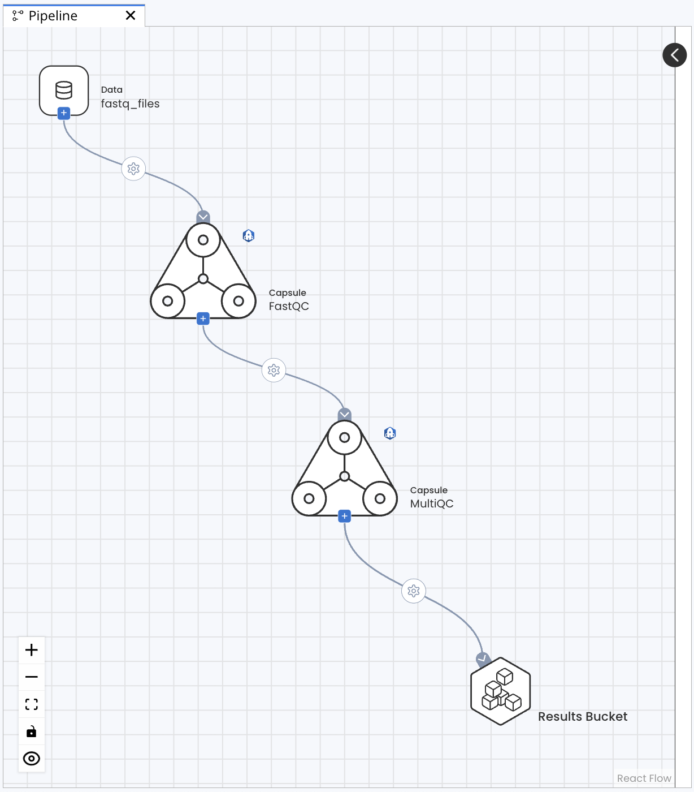

---
metaLinks:
  alternates:
    - >-
      https://app.gitbook.com/s/PvA82xvbvyt7rVs0IKXN/pipeline-guide/components-of-a-pipeline
---

# Components of a Pipeline

A standard Pipeline consists of a Data Asset followed by a series of Capsules that write results to a Results Bucket.

Each Capsule is a standalone and fully reproducible process that reads data from the `/data` folder and writes results to the `/results` folder. When implemented in a Pipeline, the contents of each Capsule’s `/data` folder are ignored. Input data can be specified by attaching a Capsule or Data Asset upstream of the Capsule so that the results of the first Capsule are passed to the `/data` folder of the second Capsule. Results from each Capsule will only be saved if it is connected to the Results Bucket.

This section covers the main components of a pipeline:

* [Nextflow File ](nextflow-file.md)
* [Capsules](capsules.md)
* [Data](data.md)
* [Results Bucket](results-bucket.md)
* [Map Paths](map-paths.md)&#x20;
* [Capsule Settings](capsule-settings.md)
* [Pipeline Settings](pipeline-settings.md)
