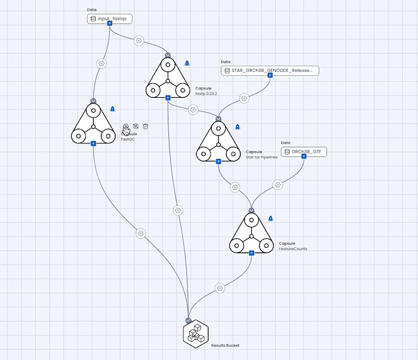
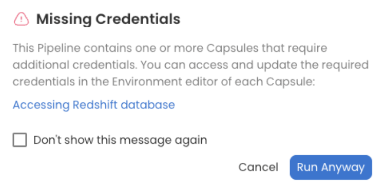

# Capsules

## Adding a Capsule to a Pipeline

To add a Capsule to the Pipeline, click the blue Plus sign, and then "Add Capsules". In the pop up window, you will be able to find Capsules by searching by name, sorting Capsules by last accessed or titles, using Capsule filters, or switching between your Capsules and Code Ocean Apps. Once you've found your Capsule, drag the Capsule card from the Add Capsule menu and drop it into the Pipeline editor.

<figure><figcaption>
Add Capsules
</figcaption></figure>

In order to be used in a Pipeline, each Capsule must have git installed in the environment. Recommended base images include git. If you are not using a recommended base image, install git as a package in the environment builder of the Capsule. In addition, all changes must be committed and a Reproducible Run performed on each Capsule of the Pipeline. If a Capsule does not have changes committed and a run performed, a hazard symbol appears beside it.

<figure><figcaption></figcaption></figure>

## Using Release Capsules in a Pipeline

Original, release, and Code Ocean Apps Capsules can be used in a Pipeline. Using the Release filter will show only Release Capsules. The Release version is indicated by the Release badge .

<figure><figcaption>
Capsule Filters
</figcaption></figure>

When adding a release Capsule, if there is more than one version, the version will have to be specified before the Capsule is added to the Pipeline editor. &#x20;

<figure><figcaption></figcaption></figure>

If the user also has a private, editable version of the Capsule, that is another option to add to the Pipeline. If the Capsules are filtered for release Capsules only, the editable version will not be listed in the drop down menu.

<figure><figcaption></figcaption></figure>

The version can be changed at any time in the Capsule's settings.

<figure><figcaption></figcaption></figure>

The version used by the Pipeline will remain unchanged if a new version of the Capsule is released.

Once the Pipeline works as intended, the Capsules in it can be released so that any subsequent changes to the Capsule do not affect the Pipeline. See[ how to release a Capsule](../../release-capsules-and-pipelines/creating-and-using-release-capsules.md).

## Removing or Replacing a Capsule from a Pipeline

To remove a Capsule from a Pipeline, hover over the Capsule and click the garbage can to remove it from the Pipeline.  This will remove the Capsule and all its connections.&#x20;

To retain the connections and map paths, replace the Capsule with another.  Hover over the Capsule and press the replace button  .  The replace feature can be used to replace Capsules while maintaining all connections and mappings.

<figure><figcaption>
Replace Capsule
</figcaption></figure>

If a Capsule has been deleted, it will appear red in the Pipeline Editor and can be easily replaced while retaining the existing connections and path mappings. It can also be deleted from the Pipeline.&#x20;

<figure><figcaption></figcaption></figure>

## Running a Pipeline with Secrets

When a Capsule that uses secrets is added to a Pipeline, the same secrets that are selected in the Capsule's environment editor will be used by the Pipeline.&#x20;


One exception is AWS Cloud Credentials.  AWS Cloud Credential secrets that are used to access external Data Assets will not be used by the Pipeline. A custom IAM role is required to use external Data Assets in a Pipeline. See [Pipeline Settings](pipeline-settings.md#aws-iam-role) for more information.&#x20;


If the required secrets have not been selected, users will receive an error when trying to run the Pipeline. The error message provides links to all the Capsules that require secrets, making it easy for users to identify which Capsules need to be updated.&#x20;

For example, if the "Accessing Redshift database" Capsule requires secrets and they have not been selected in the Capsule, users will receive the following error when trying to run the Pipeline:

<figure><figcaption></figcaption></figure>
