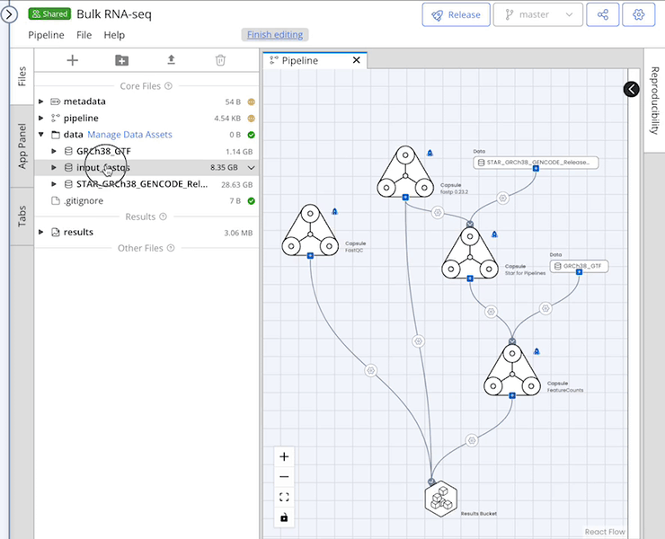
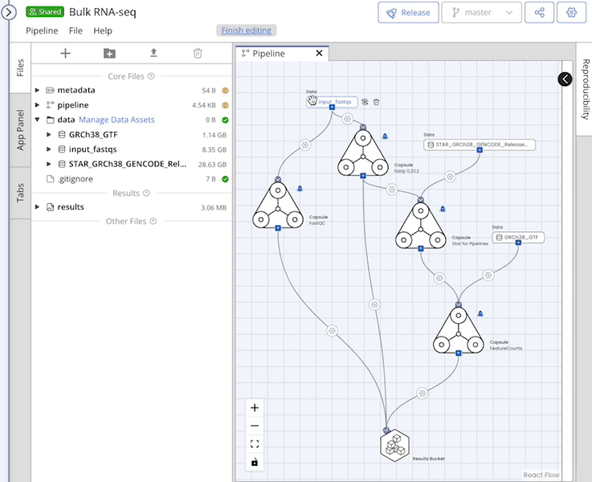
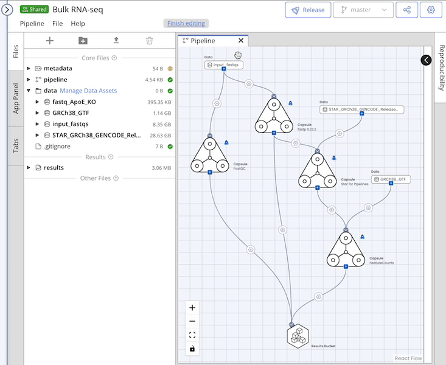

# Data

## Adding Data to a Pipeline

You can add data to your Pipeline by attaching a Data Asset from the **Manage** button next to the `/data` folder or uploading data.&#x20;

Once your data are in the File Tree system, you can drag and drop the folder into the Pipeline editor and connect it to a Capsule.

Uploaded (local) data files must be placed inside a folder before they can be dropped into the Pipeline editor. Using local files will increase run time compared to internal Data Assets. It is best practice to use Data Assets instead of local files because using Data Assets allows the same Data Asset to be easily reused in multiple Pipelines and Capsules, and enhances reproducibility by ensuring an accurate Lineage Graph.


The Pipeline will only use data that is dragged onto the Pipeline editor and connected to a Capsule.&#x20;


## Removing or Replacing Data from a Pipeline

To remove a Data Asset from the Pipeline editor you can hover over it and click the garbage can icon .

The replace feature can be used to substitute a Data Asset while maintaining all connections and mappings.&#x20;


Data Assets must be attached to the Pipeline's `/data` folder to appear in the Replace Data menu.


<figure><figcaption></figcaption></figure>

## Using External or Combined Data Assets

External Data Assets and Combined Data Assets can be used in a Pipeline. To use Data Assets linked to an AWS S3 bucket, a [custom IAM role](pipeline-settings.md#aws-iam-role) must be selected in the Pipeline Settings menu, regardless of whether the S3 bucket is private or public. See[ Pipeline Settings](pipeline-settings.md#aws-iam-role) for more information.


If you are working with external data created from a custom S3 endpoint that does not support Assumable Roles, these Data Assets cannot be used in Pipelines.&#x20;

Whether or not a custom S3 endpoint works with AWS Assumable Roles depends on the endpoint.&#x20;

