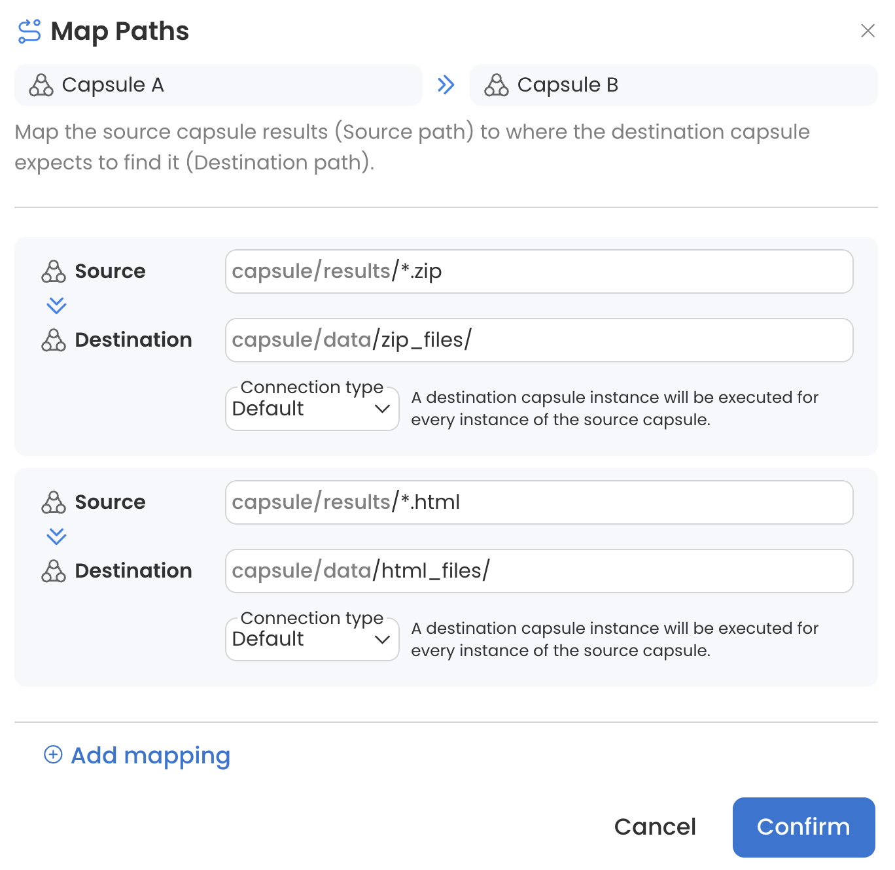
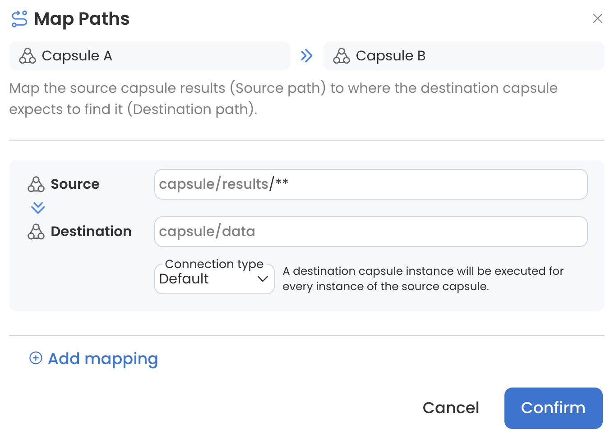
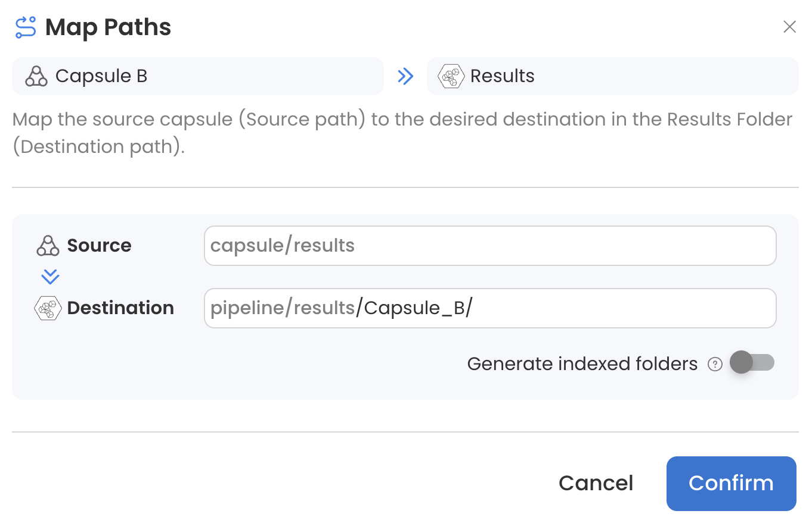

# Map Paths

From the Map Paths menu, the source and destination paths can be changed and a Connection Type can be selected. Configuring this menu properly will ensure that each Capsule receives the necessary data and that the Pipeline is optimized for parallelization.&#x20;

This section will cover the following:&#x20;

1. [Changing Source and Destination Paths](map-paths.md#changing-source-and-destination-paths)
2. [Connection Type Definitions](map-paths.md#connection-type-definitions)
3. [Data Asset to Capsule Connections](map-paths.md#data-asset-to-capsule-connections)
4. [Internal vs External Data with Collect](map-paths.md#internal-vs-external-data-with-collect)
5. [Capsule to Capsule Connections](map-paths.md#capsule-to-capsule-connections)
6. [Organizing Results](map-paths.md#organizing-results)

## Changing Source and Destination Paths

Users can customize the flow of data in a Pipeline by specifying source and destination paths. Source paths define which files should be transferred to the destination Capsule, while destination paths specify where these files should be stored in the destination Capsule. Multiple mappings can be used to provide additional configuration.

For example, Capsule A generates many different types of files in its `/results` folder. Using the following source and destination mappings, all files with the extension `.zip` will be sent to Capsule B's `/data` folder in a folder called `/zip_files` and all files with the extension .html will be sent to Capsule B's `/data` folder in a folder called `/html_files`. Any file without a .zip or .html extension will be ignored by Capsule B.

<figure><figcaption></figcaption></figure>

Files from folders and subfolders of the source (Data Asset or Capsule results) can be passed to the destination Capsule without preserving directory structure by adding `**` to the source path. This is particularly useful when combined with the Flatten Connection Type (see Capsule F in [Capsule to Capsule Connections](map-paths.md#capsule-to-capsule-connections)).&#x20;

<figure><figcaption></figcaption></figure>

## Connection Type Definitions


For the purposes of this guide, an "item" refers to a file or folder, because they are treated the same by each connection type.


### Default

**Data Asset to Capsule:** each item will be distributed to a parallel instance of the Capsule.&#x20;

**Capsule to Capsule:** a destination Capsule instance will be executed for every instance of the source Capsule.

* Items may be passed in a different order than they appear in the Data Asset.&#x20;

### Collect

**Data Asset to Capsule**: the entire Data Asset will be available to all parallel instances of the destination Capsule.&#x20;

**Capsule to Capsule:** all of the source data will be available to all parallel instances of the destination Capsule.

* If there is only one input (Data Asset or Capsule) to the destination Capsule and the Connection Type is Collect, there will only be one instance of the destination Capsule.&#x20;
* If the source data consists of a single item which is needed by all instances of the destination Capsule, Collect should be used. Otherwise only one instance of the destination Capsule will receive the source data.&#x20;
* Collect was formerly called Global.

### Flatten

**Capsule to Capsule:** the source data will be split such that every item is passed separately into parallel instances of the destination Capsule.

* Items may be passed in a different order than they appear in the Data Asset.&#x20;

## Data Asset to Capsule Connections

This example shows how items from two Data Assets will be distributed across parallel instances of a Capsule.&#x20;

The left side shows the Pipeline schematic where two Data Assets are connected to a single Capsule. Each Data Asset contains 3 items; `nums` contains 3 files and `alpha` contains 2 files and 1 folder.&#x20;

On the right is a table showing the distribution of input items across parallel Capsule instances for each connection type combination.&#x20;

<figure><figcaption></figcaption></figure>


**Special Case: two Data Assets containing an unequal number of items, both with Default selected**&#x20;

Parallel Capsule instances will be created based on the number of items in the Data Asset with fewer items. Items from the other Data Asset will be randomly distributed to parallel instances, with extra items being left out of the computation.&#x20;


## Internal vs External Data with Collect

When the connection type is set to `default`, regardless of the Data Asset type, items within the Data Asset are distributed to parallel instances of the Capsule. When the connection type is set to `collect`, items in internal vs external data are distributed differently:&#x20;

* Internal: the entire Data Asset is passed to the Capsule’s data folder. In this example, Capsule A will receive `internal/file1.txt` in its data folder.
* External: only items in the Data Asset are passed to the Capsule’s data folder. In this example, Capsule B will receive just `file2.txt` in its data folder.

## Capsule to Capsule Connections

This example shows how results generated by a source Capsule (Capsule A) affect the execution of a destination Capsule (Capsules B-F) when different connection types are used. It also shows how source mappings can be used in combination with connection types to further customize the Pipeline execution.&#x20;

In this example, there are 3 parallel instances of Capsule A, which each produce the same output. The number of Capsule icons represents the number of parallel instances.

<figure><figcaption></figcaption></figure>

## Organizing Results

### Write Files to a Folder in the Results Bucket

When many Capsules are connected to the Results Bucket, it's helpful to write each Capsule's output to a uniquely named folder. This can be achieved by opening the Map Paths menu and adding a folder name to the destination path.&#x20;

For example, Capsule B's results will be written to a folder called `Capsule_B`:&#x20;

<figure><figcaption></figcaption></figure>

If there are multiple instances of Capsule B each producing results with the same name, the Pipeline will fail unless Generate indexed folders is used.

### Generate Indexed Folders

The Map Paths menu between a Capsule and the Results Bucket has a **Generate indexed folders** switch. By default, files will be written to the Results Bucket in the same way they’re written to the Capsule’s `/results` folder. Turning on Generate indexed folders will write files to a unique folder for each instance of the source Capsule.

For example, if there are four folders in the Data Asset, passed to the Capsule with the Default connection type, and then passed to the Results Bucket with Generate indexed folder on, results from each instance will be written into separate folders named `1`, `2`, `3` and `4`.

<figure><figcaption></figcaption></figure>
