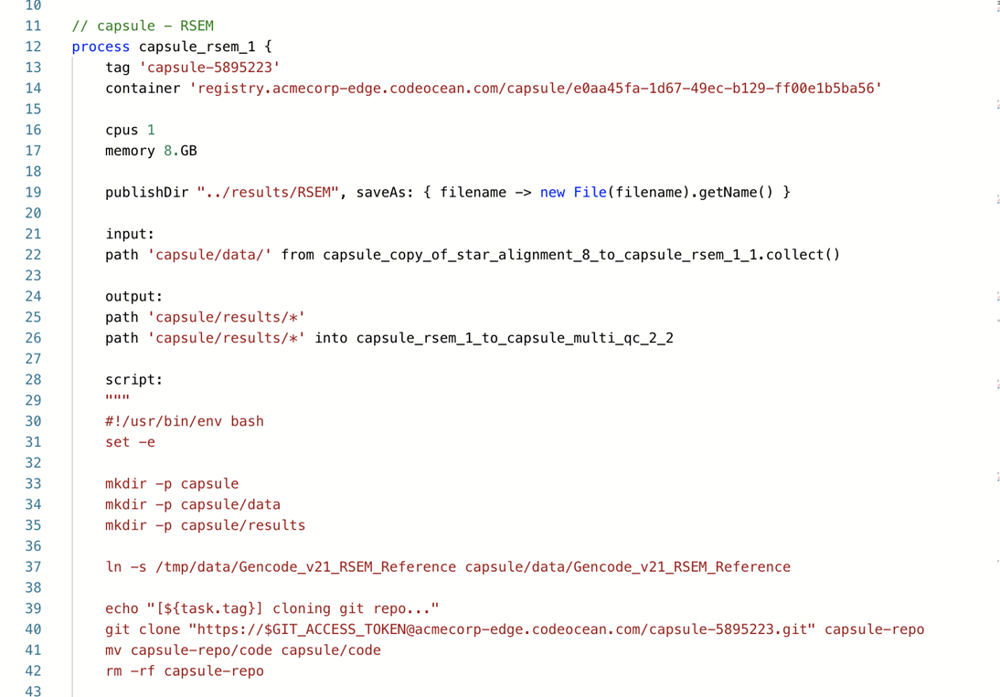
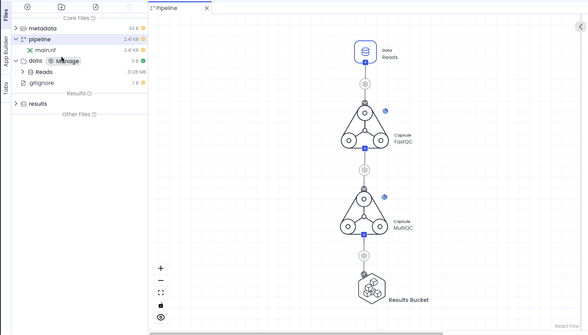

---
metaLinks:
  alternates:
    - >-
      https://app.gitbook.com/s/PvA82xvbvyt7rVs0IKXN/pipeline-guide/components-of-a-pipeline/nextflow-file
---

# Nextflow File

Similar to how the Code Ocean Environment Editor synchronously configures a Dockerfile, the Visual Pipeline Editor synchronously configures a Nextflow file.&#x20;

Nextflow is a workflow manager that integrates with Docker and other tools to ensure reproducibility independent of the computing platform. Below is an example of part of a Nextflow file for a Pipeline consisting of two capsules named RSEM and MultiQC:

The Nextflow file displays the actions that are executed to run each Capsule. Data are transferred via created Nextflow channels. The git repository corresponding to each Capsule is cloned and the reproducible run script is executed. Each run script is run in its own job with AWS Batch. The ability to run all data in one job and separate jobs in parallel can be controlled by [Connection Types](map-paths.md#connection-type-definitions).  The Nextflow file can be unlocked and customized manually.  Doing so will disable the Pipeline Editor.

## Unlocking the Nextflow File

Unlocking the Nextflow file allows you to manually edit the script, including writing your own Nextflow code.  This will disable the Pipeline Editor, but you can still [create an App Panel](../../app-panel-guide/) for a Pipeline in which the main.nf file has been unlocked. You can add Input or List named parameters into Categories from the Pipeline App Builder.  If an App Panel exists for the Pipeline when main.nf is unlocked, it will be deleted.&#x20;


Any custom Pipeline can have the Pipeline Editor enabled from the `/pipeline` folder's actions menu by clicking **Restore Pipeline Editor**.


<figure><figcaption></figcaption></figure>

#### Choose Nextflow Version for Manually Edited Pipelines 

For Pipelines in which the `main.nf` file has been unlocked, it is possible to select the Nextflow version to run (22.10.8 or 23.10.0) from the [Pipeline Settings](pipeline-settings.md) menu. This allows users to write Nextflow using DSL1 or DSL2. For more information on Nextflow version, see the [Nextflow documentation](https://www.nextflow.io/docs/latest/dsl1.html).

