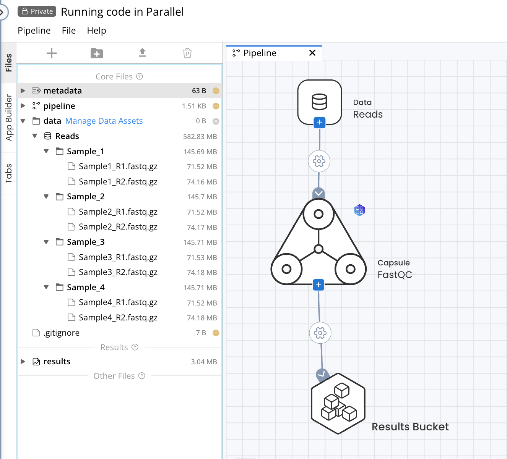
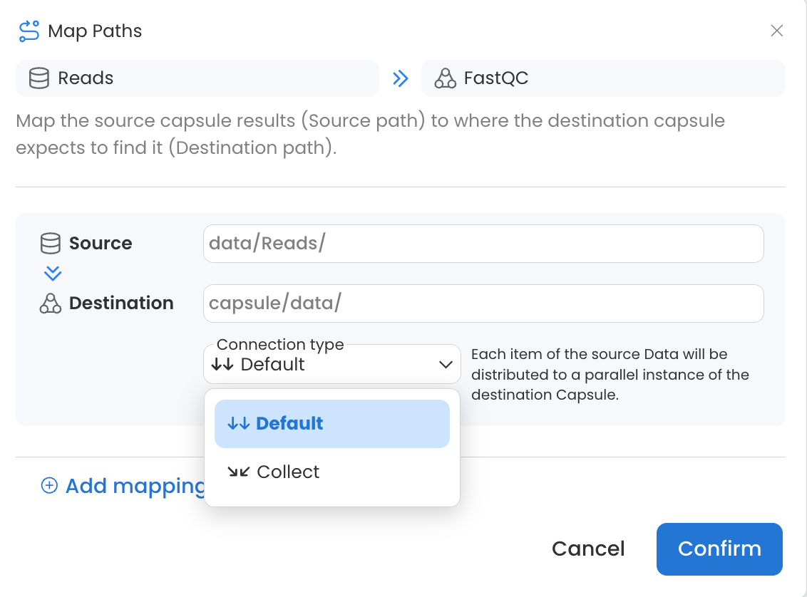
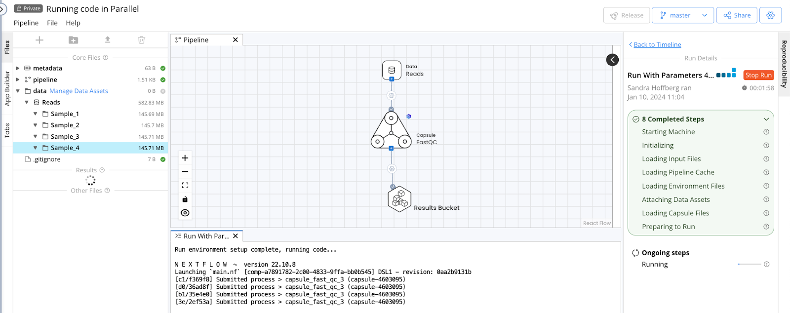
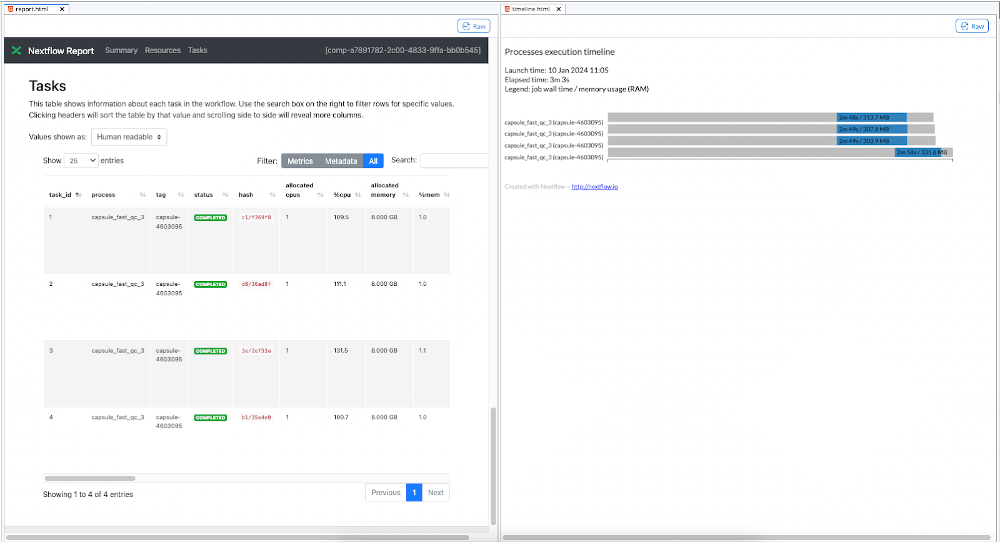
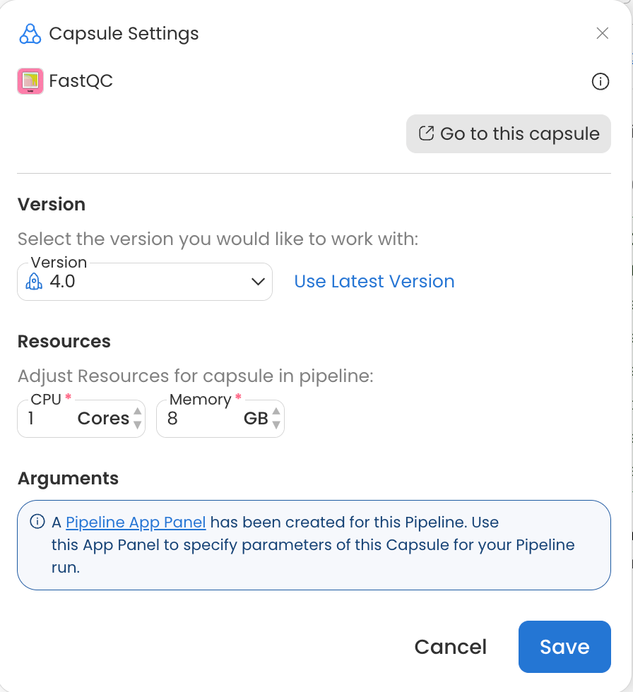

# How to Run Code in Parallel

## Use Generic Code to Handle Input Files

Hard coding input file names as shown in the example below results in decreased reusability of the code.

```
hard_coded_input=/data/illumina_run_feb2024_R1.fastq.gz
```

Instead, use bash commands to generalize code and allow the Capsule to function regardless of the input data’s naming convention. For example, if the name of the input file may vary but it will always have the same extension, a bash **find** command can be used to search for suitable input files in the data directory.

The **FastQC** Capsule in the Code Ocean Apps Library uses this approach when searching for input sequencing files to ensure that any fastq dataset with any name can be used without needing to make changes to the FastQC Capsule code.

```bash
fastq_files=$(find -L ../data -name "*.f*q*")
```

* The above command in the Capsule's `/code/config.sh` file will return the file paths for any files whose name contains \*.f\*q\* (such as .fq, .fastq, .fastq.gz, .fq.gz) in any directory within the `/data` folder.&#x20;
* The **-L** flag ensures the find command follows symbolic links, which is necessary when running Capsules on Data Assets in Pipelines.

## Supply Parameters in the App Panel

The App Panel is used to parameterize runs of your Capsule. For a detailed description of how to build and use the App Panel, see the [App Panel Guide](../app-panel-guide/). &#x20;

Parameters can be passed to a Capsule via a configuration file, where default parameters can also be set. Let’s take the Apps Library Capsule, **CombFold - prepare fasta**, as an example. When a Reproducible Run is performed, the run script containing the following code is executed.

```bash
bash prep_fastas.sh "$@"
```

The Capsule will execute this bash command to run the **prep\_fastas.sh** file with any and all positional parameters. The App Builder allows users to use positional or named parameters.

The **CombFold - prepare fasta** Capsule in the Code Ocean Apps Library has two text parameters as shown below: "Input json file" and "maximum number of residues".

<figure><figcaption></figcaption></figure>

The code block below shows a portion of the file located at `/code/config.sh` in the aforementioned **CombFold - prepare fasta** Capsule, which is used to interpret these App Panel Parameters.

```sh
if [ -z ${1} ]; then
    json_file=$(find -L ../data -name "*.json")
else
    json_file=${1}
fi

json_count=$(echo $json_file | wc -w)

if [ -z ${2} ]; then
    max_af_size=1800
else
    max_af_size=${2}
fi
```

In the example code, the parameters are interpreted as follows:

1. If the first parameter is empty, search for a .json file in the `/data` folder; otherwise, use the text supplied as parameter 1.
2. If the second parameter is empty, set the maximum AF size to 1800; otherwise, use the value supplied as parameter 2.

By using this file, the input json file need not be specified repeatedly in the App Panel for each run. The Capsule can detect the input file and run without additional user input if a single json file is passed to the Capsule at a time. Specific connection types in Code Ocean Pipelines facilitate doing just this. See below for more details. &#x20;


The [Code Ocean Apps Library](../code-ocean-apps/) includes many examples of Capsules with configuration files for text, list, and file parameters, written in bash, python, and R programming languages.


In a Pipeline which contains one or more Capsules that have an App Panel, you can make the parameters of all individual Capsule App Panels available in one Pipeline App Panel.  See [Pipeline App Panel](the-pipeline-ui/pipeline-app-panel.md) for more information.

## Give Output a Unique Name

In a Code Ocean Capsule, you must specify the `/results` folder as the output directory for results to be saved. In a Pipeline, the Capsule must be connected to the **Results Bucket** to save results when the Pipeline is run.

When running Capsules in parallel in a Pipeline, name collisions caused by duplicate output file names will cause the Pipeline to fail. Therefore, it is best practice to specify in Capsule code that output files are saved with unique names based on e.g. the input file, or in a folder with a unique name.&#x20;

For example, the Code Ocean Apps Library Capsule, **Sambamba Sort and Index** saves output as:

```
"../results/${prefix}/${prefix}.bam"
```

Where **prefix** is the name of the input file without the .bam extension, as defined here.

```
prefix=$(basename $bamfile .bam)
```

It is also possible to use the **Generate indexed folders** toggle in the connection settings of a Capsule to Results Bucket connection to produce a separate, numbered folder for the results of each Capsule instance. See [Generate Indexed Folders](components-of-a-pipeline/map-paths.md#generate-indexed-folders) for more details.

<figure><figcaption></figcaption></figure>

## Configure Your Capsule in the Pipeline

As an example, we will configure a single-Capsule Pipeline consisting of the Apps Library **FastQC** Capsule which will be used to process a Data Asset containing four samples of paired-end short read sequencing data. The full documentation for Pipeline options can be found in [Components of a Pipeline](components-of-a-pipeline/).&#x20;

<figure><figcaption></figcaption></figure>

### Configure the Capsule Connection Type

When passing Data Assets to Capsules in a Pipeline, two connection types are available.&#x20;

<figure><figcaption></figcaption></figure>

1. **Default**: Each item (file or folder) of the source Data will be distributed to a parallel instance of the destination Capsule. In this example, a new Capsule instance will run for each folder in the Data Asset, resulting in 4 parallel instances of FastQC.
2. **Collect**: The entire source Data will be made available to all parallel instances of the destination Capsule. In this example, a single Capsule instance would run with the entire contents of the Data Asset.

Using the **Default** connection type will allow the code to run on each Sample folder in parallel, as indicated by the Pipeline **output** file showing 4 processes submitted when the Pipeline is started. Each process corresponds to a single folder and instance of the FastQC Capsule.

<figure><figcaption></figcaption></figure>

This can also be confirmed when the run completes by checking files in the `/nextflow` folder produced by each run, which is accessible via the Pipeline's Timeline. In this example, the report.html and timeline.html show four instances of FastQC, one for each folder in the Data Asset.  See [The Nextflow folder](nextflow-artifacts.md) for more information.&#x20;

<figure><figcaption></figcaption></figure>


When passing data from Capsule to Capsule, a third connection type is possible.

3. **Flatten**: The source Capsule output will be split, such that each item (file or folder) is passed separately to a parallel instance of the destination Capsule. This functions the same as the **Default** connection type between Data Assets and Capsules.&#x20;


<figure><figcaption></figcaption></figure>

Using Default for Data Asset to Capsule connections, or using Flatten for Capsule to Capsule connections will facilitate running code in parallel because each new Capsule will start simultaneously.&#x20;


There is no limit to the number of Capsule instances that can be run in parallel in a Pipeline.


### Configure Capsule Resources

When multiple instances of a Capsule are started in a Pipeline, each is run with the resources specified in the **Resources** section of the Capsule Settings. You can open the Capsule Settings by double clicking on a Capsule in a Pipeline or hovering over the Capsule and clicking the gear icon. For more details see the [Capsule Settings](components-of-a-pipeline/capsule-settings.md) guide.


<figure><figcaption></figcaption></figure>


## Other Considerations

Adding `**` to the Source Map Path as shown in the screenshot below will pass files from folders and subfolders of the Source without preserving directory structure. This is particularly useful when combined with the Default or Flatten Connection Type, as it will pass each file in the Data Asset to a parallel instance of the destination Capsule. If this were used between the Reads Data Asset and FastQC Capsule in our example, eight instances of FastQC would run in parallel instead of four because there are eight items in the Data Asset after the directory structure is removed. See the [Map Paths](components-of-a-pipeline/map-paths.md) guide for more information.

<figure><figcaption></figcaption></figure>

Multiple runs of the same Pipeline can be performed concurrently by clicking the **Run** button in the Pipeline IDE. Results of each run will be visible separately in the Timeline.


<figure><figcaption></figcaption></figure>

