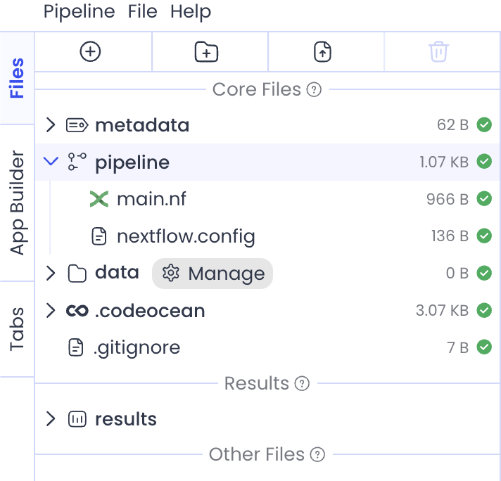

# Nextflow Configurations

Advanced Pipeline settings can be defined without disabling the Pipeline UI by creating a [configuration file](https://www.nextflow.io/docs/latest/config.html) in the Pipeline’s /pipeline folder. This file must be called nextflow.config in order for it to be used by the Pipeline.

<figure><figcaption></figcaption></figure>

## Examples

1. [Retry Strategy with a Delay Between Submissions](nextflow-configurations.md#retry-strategy-with-a-delay-between-submissions)
2. [Pipeline Cost Monitoring](nextflow-configurations.md#pipeline-cost-monitoring)
3. [Dynamic Compute Resources](nextflow-configurations.md#dynamic-compute-resources)

## Retry Strategy with a Delay Between Submissions

In the [Pipeline Settings](components-of-a-pipeline/pipeline-settings.md#error-strategy) menu, a retry error strategy can be set, but when retrying submissions due to transient AWS outages, it can be beneficial to add a delay between job submissions.

```
process {
   errorStrategy = { sleep(Math.pow(2, task.attempt) * 200 as long); return 'retry' }
   maxRetries = 5
   maxErrors = 20
}
```

The line `sleep(Math.pow(2, task.attempt) * 200 as long)` implements an exponential backoff strategy, where sleep pauses execution for the specified number of milliseconds. For example, if a task has failed twice already, it will sleep for `200*2^3 = 1600ms`.

## Pipeline Cost Monitoring

The cost of Pipeline runs are not currently tracked in the Analytics Dashboard of the Admin Panel, but [resource labels](https://www.nextflow.io/docs/latest/reference/process.html#process-resourcelabels) can be added to the `nextflow.config` file so that Pipeline jobs are tagged and included in the [AWS Cost and Usage Report (CUR)](https://docs.aws.amazon.com/cur/latest/userguide/what-is-cur.html). To view these tags in the CUR, they first need to be activated as shown [here](https://docs.aws.amazon.com/awsaccountbilling/latest/aboutv2/activating-tags.html).

`process.resourceLabels = ['your-key': 'your-value']`

Replace the key and value with a pattern that suits your organization, for example `'your-key'` could be a group's name, and `'your-value'` could be the name of the Pipeline. This way the group's Pipeline costs will all appear under the same key in the CUR.

## Dynamic Compute Resources

[Compute resources](components-of-a-pipeline/capsule-settings.md#compute-resources) selected in the Pipeline UI are encoded in the corresponding `process` in the `main.nf`. For example, this is the Nextflow code for "Capsule A" that's allocated 1 core and 8 GB of RAM:

```
// capsule - Capsule A
process capsule_capsule_a_1 {
	tag 'capsule-6862906'
	container "$REGISTRY_HOST/capsule/db7adf82-5376-45a5-b9c0-9ad318aef191"

	cpus 1
	memory '8 GB'
```

When the compute resources depend on the size of data that's being processed, [Nextflow's dynamic resources feature](https://www.nextflow.io/docs/latest/process.html#dynamic-task-resources) can be used so that the size of the machine scales with demand. \
\
In the `nextflow.config` example code below, the Capsule will run with 1 core and 8 GB of RAM but if it fails with an out of memory error (exit status between 137-140) it will automatically retry with more resources, up to 3 times. For example, if it fails with an out of memory error 3 times, it will retry with `8.GB * task.attempt` = `8.GB * 4` = 32 GB RAM and `1 * task.attempt` = `1 * 4` = 4 CPUs. If it fails with any other exit code, the `'finish'` error strategy takes effect and the pipeline will initiate an orderly shutdown, pending the completion of any submitted jobs.

```
process {
    withName:capsule_capsule_a_1 { 
        cpus   = { 1    * task.attempt }
        memory = { 8.GB * task.attempt }

        errorStrategy = { task.exitStatus in (137..140) ? 'retry' : 'finish' }
        maxRetries    = 3
    }
}
```


With this configuration, dynamic resources will only apply to "Capsule A" and all other Capsules will use the error strategy set in the Pipeline Settings.

