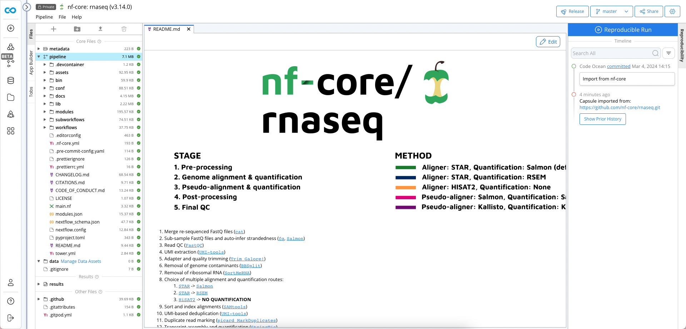
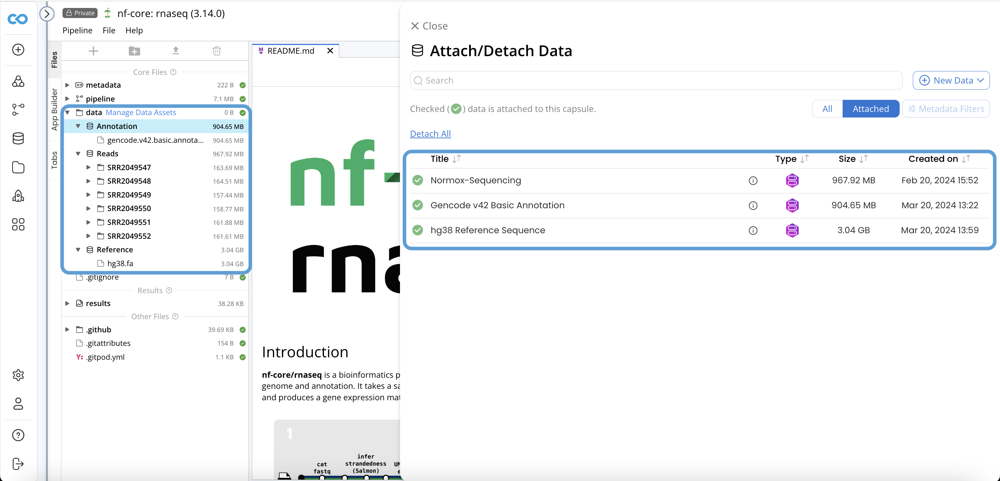

---
metaLinks:
  alternates:
    - >-
      https://app.gitbook.com/s/PvA82xvbvyt7rVs0IKXN/pipeline-guide/nf-core-pipelines/nf-core-rnaseq-tutorial
---

# nf-core RNASeq Tutorial

This tutorial demonstrates how to run [nf-core's RNAseq pipeline](https://nf-co.re/rnaseq/3.14.0) on Code Ocean. **nf-core/rnaseq** is a bioinformatics pipeline that can be used to analyse RNA sequencing data obtained from organisms with a reference genome and annotation. It takes a samplesheet and FASTQ files as input, performs quality control (QC), trimming and (pseudo-)alignment, and produces a gene expression matrix and extensive QC report.&#x20;

## Table of Contents

1. [Prerequisites](./#prerequisites)
   1. [Example Sequencing Reads](./#example-sequencing-reads)
   2. [hg38 Reference Sequence](./#hg38-reference-sequence)
   3. [hg38 Annotation](./#hg38-annotation)
2. [Create the Pipeline](./#create-the-pipeline)
3. [Attach Data Assets to Pipeline](./#attach-data-asset-to-pipeline)
4. [Configure Sample Sheet](./#configure-sample-sheet)
5. [Configuring App Panel](./#configuring-app-panel)
6. [Reproducible Run](./#reproducible-run)
7. [Results](./#results)

## Prerequisites

First, create an Internal Data Asset of the sequencing reads. This Data Asset can be imported from the public S3 bucket with the following bucket name and path:

We shall use the following Data Asset to demonstrate.

### Example Sequencing Reads

**Bucket Name:** codeocean-public-data

**Path:** example\_datasets/Normox

<figure><figcaption></figcaption></figure>


To use External Data Assets in a Pipeline, [Assumable Roles](../../components-of-a-pipeline/pipeline-settings.md#aws-iam-role) must be configured by a Code Ocean admin.


### hg38 Reference Sequence

**Bucket Name:** codeocean-public-data

**Path:** genomes/hg38/Reference/

<figure><figcaption></figcaption></figure>

### hg38 Annotation

**Bucket Name:** codeocean-public-data

**Path:** genomes/hg38\_Annotation

<figure><figcaption></figcaption></figure>

## Create the Pipeline

* From the Sidebar, create a new Pipeline by **Import from nf-core**
* Search for **rnaseq** and **v3.14.0**
* Click on **Import** to import the pipeline into your deployment. &#x20;

<figure><figcaption></figcaption></figure>

Once the pipeline has been imported you'll be greeted with its README file

<figure><figcaption></figcaption></figure>

## Attach Data Assets to the Pipeline

Click on **Manage Data Assets**

<figure><figcaption></figcaption></figure>

\
Search and Attach the following 3 Data Assets:

1. **Normox-Sequencing**
2. **Gencode v42 Basic Annotation**
3. **hg38 Reference Sequence**

## Configure the Sample Sheet

Edit the sample sheet at `/pipeline/assets/samplesheet.csv` to specify the sample names, location of read 1 and read 2 (if paired end), and strandedness.  The strandedness refers to the library preparation and will be automatically inferred if set to `auto`. Must be one of `unstranded`, `forward`, `reverse` or `auto`. Rows with the same sample identifier are considered technical replicates and merged automatically.&#x20;

```
sample,fastq_1,fastq_2,strandedness
control_REP1,../data/Reads/SRR2049547/SRR2049547_1.fastq.gz,../data/Reads/SRR2049547/SRR2049547_2.fastq.gz,auto
control_REP2,../data/Reads/SRR2049548/SRR2049548_1.fastq.gz,../data/Reads/SRR2049548/SRR2049548_2.fastq.gz,auto
control_REP3,../data/Reads/SRR2049549/SRR2049549_1.fastq.gz,../data/Reads/SRR2049549/SRR2049549_2.fastq.gz,auto
treatment_REP1,../data/Reads/SRR2049550/SRR2049550_1.fastq.gz,../data/Reads/SRR2049550/SRR2049550_2.fastq.gz,auto
treatment_REP2,../data/Reads/SRR2049551/SRR2049551_1.fastq.gz,../data/Reads/SRR2049551/SRR2049551_2.fastq.gz,auto
treatment_REP3,../data/Reads/SRR2049552/SRR2049552_1.fastq.gz,../data/Reads/SRR2049552/SRR2049552_2.fastq.gz,auto
```

## Configure the App Panel

In the App Panel, update the **Input,** **Fasta** and **Gtf** parameters according to the location of your data.

<figure><figcaption></figcaption></figure>

Delete the value of the **Igenomes Base** parameter as those resources are not used in this tutorial.  See [iGenomes](igenomes.md) for instructions on how to use iGenomes resources.

<figure><figcaption></figcaption></figure>

## Reproducible Run

Click on **Run** or **Run with Parameters**

<figure><figcaption></figcaption></figure>

## Results

The Results are available in the Pipeline Timeline and a [Data Asset](../../../data-assets-guide/capturing-a-result/) can be created for downstream processing.&#x20;

<figure><figcaption></figcaption></figure>
