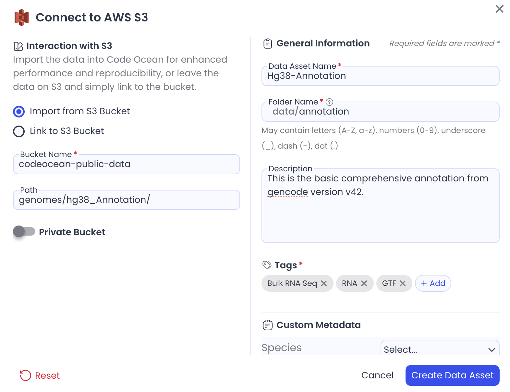

# Pipeline Tutorial

This tutorial provides a comprehensive explanation of each Pipeline feature while building an RNA Sequencing pipeline from scratch. The list of [chapters](pipeline-tutorial.md#chapters) shows what features are covered and can be used to skip to the most relevant parts. Each Capsule is available on the Code Ocean Apps Library and all Data Assets have been made public allowing you to follow along and build the Pipeline yourself.



## Chapters

* [00:00](https://www.loom.com/share/bc5c20e4388a4bc9ac26595f59da4b0f?t=0) Pipeline overview
* [02:24](https://www.loom.com/share/bc5c20e4388a4bc9ac26595f59da4b0f?t=144) Connecting Capsules
* [06:01](https://www.loom.com/share/bc5c20e4388a4bc9ac26595f59da4b0f?t=361) Adding Data Assets
* [06:25](https://www.loom.com/share/bc5c20e4388a4bc9ac26595f59da4b0f?t=385) main.nf explained
* [07:42](https://www.loom.com/share/bc5c20e4388a4bc9ac26595f59da4b0f?t=462) Requirements for using a Capsule in a Pipeline
* [08:28](https://www.loom.com/share/bc5c20e4388a4bc9ac26595f59da4b0f?t=508) Considerations when designing a Capsule for a Pipeline
* [14:17](https://www.loom.com/share/bc5c20e4388a4bc9ac26595f59da4b0f?t=857) Understanding connection types (parallelization)
* [29:20](https://www.loom.com/share/bc5c20e4388a4bc9ac26595f59da4b0f?t=1760) Map Paths: source and destination paths
* [33:10](https://www.loom.com/share/bc5c20e4388a4bc9ac26595f59da4b0f?t=1990) Capsule Settings
* [34:53](https://www.loom.com/share/bc5c20e4388a4bc9ac26595f59da4b0f?t=2093) Pipeline App Panel
* [37:30](https://www.loom.com/share/bc5c20e4388a4bc9ac26595f59da4b0f?t=2250) Pipeline settings (cache, IAM roles, error strategies)
* [44:35](https://www.loom.com/share/bc5c20e4388a4bc9ac26595f59da4b0f?t=2675) Running the Pipeline
* [47:30](https://app.gitbook.com/o/-MFlla4BKtMCc25E_JLC/s/zruZ8z7A3lx6WFGCjiOE/) Nextflow Artifacts
* [50:24](https://www.loom.com/share/bc5c20e4388a4bc9ac26595f59da4b0f?t=3024) Debugging strategies
* [53:00](https://www.loom.com/share/bc5c20e4388a4bc9ac26595f59da4b0f?t=3024) Writing Nextflow and nf-core Pipelines

## Data Assets

All 3 Data Assets used in the tutorial should be imported to your deployment to ensure they can be used without an IAM role.

1. [Paired End Reads](pipeline-tutorial.md#paired-end-reads-8gb)
2. [STAR Index](pipeline-tutorial.md#star-index-28gb)
3. [Annotation File](pipeline-tutorial.md#annotation-file-1gb)

### Paired End Reads (8GB)

**Bucket Name:** `codeocean-public-data`

**Path:** `example_datasets/rna-seq-tutorial/GSE157194_reads/`

<figure><figcaption></figcaption></figure>

### STAR Index (28GB)

**Bucket Name:** `codeocean-public-data`

**Path:** `example_datasets/STAR_GRCh38_GENCODE_Release_21_Index/star_index/`

<figure><figcaption></figcaption></figure>

### Annotation File (1GB)

**Bucket Name:** `codeocean-public-data`

**Path:** `genomes/hg38_Annotation/`

<figure><figcaption></figcaption></figure>

