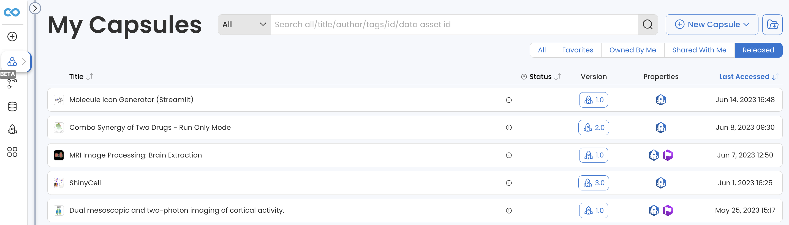

# Creating and Using Release Capsules

The release Capsule will inherit the sharing permissions of the original. Once it has been created, the sharing permissions of the release can be changed independently of the original.

## **Releasing a Compute Capsule**

1.  Click **Release** in the top right corner of your Capsule to begin the release process.\
     

    <figure><figcaption></figcaption></figure>
2. Complete the mandatory pre-release steps:
   * Fill out the required metadata.
   * Perform a Reproducible Run that includes all the latest changes.&#x20;
   * Ensure all files in your Capsule are either tracked in Git or intentionally excluded from Git by adding them to the .gitignore file.
3.  Once you've completed all the criteria, the Capsule can be released. This creates a separate run-only version of your Capsule that is available to anyone with access to the original.\
    \
    You can access the release version from the Capsule Timeline.

    <figure><figcaption></figcaption></figure>
4. If you continue to develop the original Capsule and would like changes to be reflected in the release version, you can update the release Capsule by clicking **Release a new version** in the original Capsule.\
   &#x20;\
   All versions will be available in the release Capsule’s Timeline as well as through a dropdown menu above the Timeline. From any release version, users can easily toggle to others.

<figure><figcaption></figcaption></figure>


Only Owners of the Capsule or Pipeline can release it.


### No-Code Apps

Capsules that are used as No-Code Apps have an additional field to complete in the metadata page: the type of No-Code App must be selected.&#x20;

In the pre-release page, No-Code App options will be available for release depending on the Capsule's history. The options are:

1. App Panel, if a valid App Panel has been created.&#x20;
2. Shiny, if the Shiny Cloud Workstation has been used.
3. Streamlit, if the Streamlit Cloud Workstation has been used.
4. Ubuntu, if the Ubuntu Cloud Workstation has been used.
5. IGV, if the IGV Cloud Workstation has been used.

<figure><figcaption></figcaption></figure>


This will ensure the appropriate Cloud Workstation is available in the release Capsule. These Apps can be launched directly from Collections by clicking "**Open App**" for the corresponding Capsule or Pipelines.

Additionally,  CW No-Code Apps can be shared and directly launched by clicking "**Copy Run Link**" in the asset's Share window.&#x20;


## **Find a Release Capsule**

Navigate to the My Capsules dashboard (.png>)) in the left sidebar. Select the **Released** tab to view any release Capsule you have access to.&#x20;

<figure><figcaption></figcaption></figure>

## Working with a Release Capsule

From the original Capsule, navigate to the release Capsule by clicking **Go To Release Capsule** in the Timeline. The Capsule's release status is indicated by a blue **Release** label to the left of the Capsule's title.&#x20;

<figure><figcaption></figcaption></figure>

In the release Capsule you can explore any files the author made available, execute Reproducible Runs, create Data Assets from results, and duplicate the release version.&#x20;

In the release Capsule, click **Reproducible Run** to execute a run. A pop-up message appears to indicate the estimated re-run time. Click **Proceed** to continue.

Any user with access to the release Capsule can do a Reproducible Run, but in the Timeline each user will only see the Release Results and results from runs they started.

<figure><figcaption></figcaption></figure>

To edit a release version, you must duplicate it first.

1. Click **Capsule** in the menu.
2. Click **Duplicate**.

You are redirected to the newly duplicated Capsule. The Capsule name becomes Copy of + _the original Capsule name_.&#x20;
