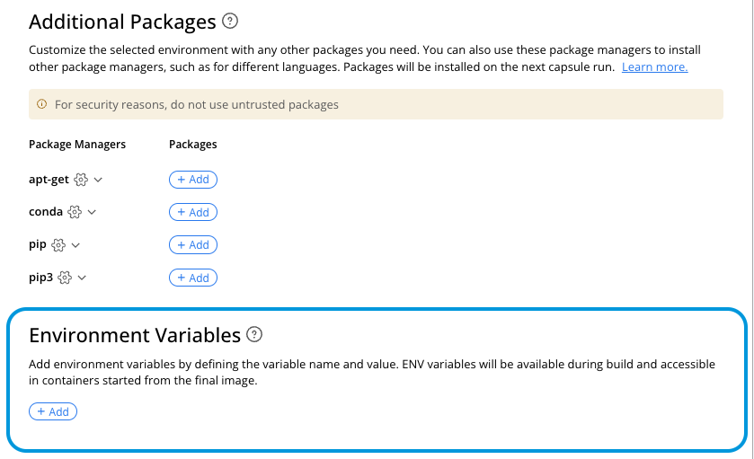
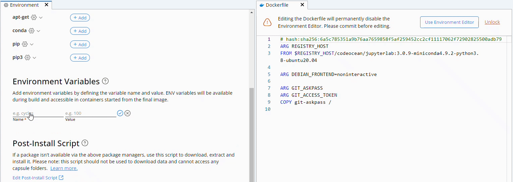

# Environment Variables

## User-Created Environment Variables

Users can define environment variables in the Environment Editor, as shown below. These variables are automatically added to the Capsule's Dockerfile before installation commands, allowing them to be used during the environment build phase if needed. During runtime, the reference to the variable is replaced with its value.

<figure><figcaption></figcaption></figure>


* Environment variable names must always start with a letter or underscore ("\_") and may only consist of alphanumeric characters and underscores ("\_").
* Environment variable names are case-insensitive, meaning that `ABC` and `abc` cannot both exist in the same Capsule.


To edit a user-created environment variable, click its name. To delete it, click the **X** to the right of the variable, as shown below.

<figure><figcaption></figcaption></figure>

## Changing the executable PATH

The `PATH` environment variable specifies directories where executable programs are located. For programs installed by package managers, the `PATH` usually does not require modification. However, for programs installed in the [Post-Install script](the-post-install-script.md), the `PATH` can be reassigned in the Post-Install script. This will take effect only when working in a Cloud Workstation. When performing a Reproducible Run, the `PATH` should be set in the [Environment Variables](environment-variables.md#user-created-environment-variables) section of the Environment editor.&#x20;

## Code Ocean Specific Environmental Variables

**CO\_CPUS:** The number of available CPU cores.

**CO\_MEMORY:** The available RAM in bytes.

**CO\_COMPUTATION\_ID:** The unique identifier of the current computation.

**CO\_CAPSULE\_ID:** The Capsule's unique identifier, also available in the metadata page.

**CO\_PIPELINE\_ID:** The Pipeline's unique identifier, also available in the **Metadata** page. Only present in a Pipeline Reproducible Run.

**GIT\_ACCESS\_TOKEN:** Only defined if a user has entered their Git credentials in the **Account** page.

**CO\_SOURCE\_CAPSULE\_ID:** The unique identifier of the Capsule that initiated the Automation Capsule. Only present in an Automation Capsule computation.

**CO\_SOURCE\_COMPUTATION\_ID:** The unique identifier of the computation that initiated the Automation Capsule. Only present in Automation Capsule computation.

**CO\_SOURCE\_EXIT\_CODE:** The exit code of the computation that initiated the Automation Capsule. Only present in an Automation Capsule computation.

### Use in Pipelines

Each Capsule in a pipeline has its own `CO_CPUS`, `CO_MEMORY`, and `CO_CAPSULE_ID` variables, but all Capsules share the same `CO_PIPELINE_ID` and `CO_COMPUTATION_ID`.

`CO_CPUS` and `CO_MEMORY` variables should always be used over other approaches when the CPU and memory count is used by a capsule. Since Code Ocean Pipelines run on AWS Batch, manually calculating the CPU and memory count can be inaccurate due to discrepancies between the resources a job has been allocated and the total resources of the machine the job is running on.&#x20;

### Examples

#### Passing the CPU Count to FastQC

FastQC is a command line tool for quality control of sequencing reads. The following code shows how `CO_CPUS` can be used as an argument to accelerate the computation by leveraging all available CPUs.&#x20;

```
#!/usr/bin/env bash
for file in $(find -L ../data -name "*.fastq*"); do
    echo "Running FastQC on $(basename -a $file)"
    fastqc -t $CO_CPUS --outdir ../results $file
done
```

#### Maintaining Traceability When Transferring Data to External Locations

If the result of a Capsule or Pipeline is transferred outside of Code Ocean, the `CO_CAPSULE_ID`/`CO_PIPELINE_ID` and `CO_COMPUTATION_ID` variables can be used to help maintain traceability. The following code shows how these variables can be saved to a text file and transferred to the same external S3 bucket where the results are saved. Saving these unique identifiers ensures reproducibility by tracking the exact Capsule and computation that generated the result.

```
#!/usr/bin/env bash

#Transfer results to S3
aws s3 sync ../results/ s3://${S3_BUCKET_NAME}/path/to/results/

#Save unique identifiers to the same location
echo "Capsule ID: $CO_CAPSULE_ID" >> ../results/traceability.txt
echo "Computation ID: $CO_COMPUTATION_ID" >> ../results/traceability.txt

aws s3 cp ../results/traceability.txt s3://${S3_BUCKET_NAME}/path/to/results/
```

