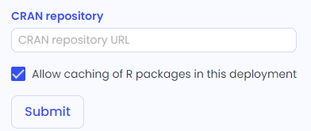
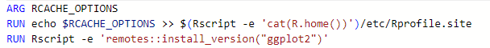

---
metaLinks:
  alternates:
    - >-
      https://app.gitbook.com/s/PvA82xvbvyt7rVs0IKXN/setting-up-the-environment/installing-r-packages
---

# Installing R packages

## R Package Caching

Installing an R package on Linux can be time-consuming because the package must be downloaded, compiled, and installed. As a result, users can experience long build times when rebuilding the environment. R Caching stores binary (compiled) versions of packages, allowing the system to reuse them and skip the downloading and compiling steps for previously installed packages.

R Caching is enabled by default, and can be managed in the Admin Panel where administrators can enable or disable R Caching and add a private CRAN repository (e.g., your organization's own repository). This repository should function as an open CRAN mirror, returning the index and packages as expected by any self-hosted mirror.

<figure><figcaption></figcaption></figure>

Once R Caching is enabled, new Capsules will automatically have the required command added to their Dockerfiles when packages are added via R(CRAN) or Bioconductor.For existing Capsules, the command is added to the Dockerfile when it is modified.

<figure><figcaption></figcaption></figure>

## Environment Build Errors

An environment build may complete successfully, but a package might still be unavailable during runtime. This issue often arises when an R package does not return a non-zero error. As a result, the environment builds successfully, but some packages are not installed. In such cases, the package version remains marked as "latest" because it was never installed. For instance, if you select an R base image and add the 'nloptr' package to R(CRAN), the environment may appear to run correctly, but the 'nloptr' package will not be installed, and no version will be pinned.

To resolve this, find the `buildLog` (which is saved in the results folder if the environment is rebuilt) and search for the package's name. Usually, you'll find the missing system dependencies in the log.

Finally, add those missing packages according to the environment page and try to build the environment again.&#x20;

<figure><figcaption></figcaption></figure>


Depending on the complexity of the packages, you may need to check and rebuild several times till the packages are installed. Sometimes the missing packages are other R packages that should be added to R(CRAN).

