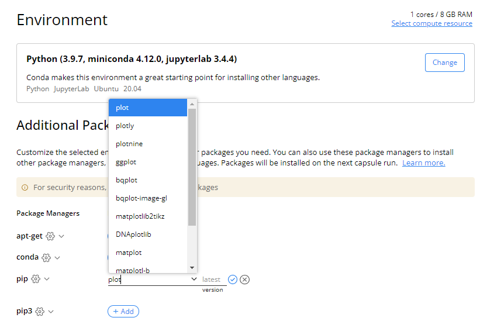
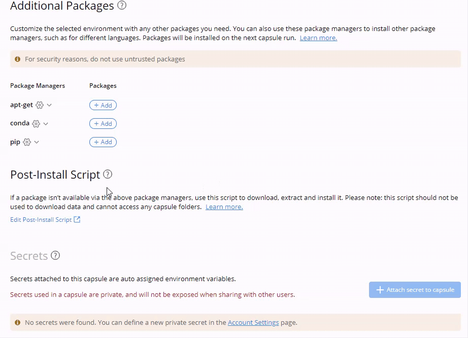

---
metaLinks:
  alternates:
    - >-
      https://app.gitbook.com/s/PvA82xvbvyt7rVs0IKXN/setting-up-the-environment/packages-and-package-manager
---

# Package Managers and Adding Packages

## Package Managers

Package Managers are automatically added to the Capsule Environment Editor based on the Starter Environment chosen for the Capsule. When a Custom Base Image is used, Code Ocean will automatically detect the appropriate package managers and make them available in the Environment Editor.

Every Code Ocean Recommended Starter Environment includes apt-get, the command–line tool for working with APT (Advanced Package Tool) software packages, as it is generally the preferred way to install packages in Linux distributions.

## Adding Packages

After you choose the Starter Environment, you can add packages using the package managers to further establish your computational environment. When adding a package without a version number, the system will download the latest version of the package.



Once you have selected a Starter Environment, selected all of the packages to be installed through the package managers or postInstall script, set Environment Variables, and added secrets if needed, and run the Capsule, **the environment will build with this configuration and be cached for future use.**

The system detects changes to the environment (i.e., changes in the Dockerfile) to determine whether to trigger a rebuild or not. If the environment is not modified, it utilizes the cache information from the previous build to skip the build phase. Changes to any of the aforementioned environment configurations will trigger a rebuild. This ensures your results are reproducible using the exact packages and versions at run time.


Pip supports installing from various version control systems, like git. The supported schemes are `git+file`, `git+https`, and `git+ssh`. Using this format, you can provide a URL to install a private package. It is also possible to specify a “git ref” such as branch name, a commit hash or a tag name:

```
MyProject @ git+https://git.example.com/MyProject.git@master
MyProject @ git+https://git.example.com/MyProject.git@v1.0
MyProject @ git+https://git.example.com/MyProject.git@da39a3ee5e6b4b0d3255bfef95601890afd80709
MyProject @ git+https://git.example.com/MyProject.git@refs/pull/123/head
```

When passing a commit hash, specifying a full hash is preferable to a partial hash because a full hash allows pip to operate more efficiently (e.g. by making fewer network calls).&#x20;

### Auto Complete Package Names

Each package manager contains a dropdown list of common packages which will automatically begin completing when you begin typing a package in the field.


This list is case sensitive and can also suggest items when searched for as sub-strings.


<figure><figcaption></figcaption></figure>

## Advanced Settings for Package Managers

### Configure Package Managers

Some packages require specific configurations for installation, for example, configuring the Bioconda channel for the Conda or Mamba package managers.

1. Click the gear icon () next to the package manager.&#x20;
2. Select **Configure \[package manager name]**.
3. Enter the information for the additional setting.


### Reset Package Versions to "Latest"

This affects all packages installed via the chosen package manager and allows you to install the latest version of all packages in bulk. Instead of removing each version, you can use this feature to do it all at once.

1. Click the gear icon () next to the package manager.&#x20;
2. Select **Reset package versions to 'latest'**.



There is no confirmation message for this action. Use it with caution.

A preferred practice is to commit changes before resetting all of the package versions in the package manager so that you can revert the change.&#x20;


### Remove All Packages

Instead of removing the packages one by one, you can remove all packages installed via a specific package manager in bulk.&#x20;

1. Click the gear icon () next to the relevant package manager.&#x20;
2. Select **Remove all packages**.



There is no confirmation message for this action. Use it with caution.

A preferred practice is to commit changes before removing all the packages in the package manager so that you can revert the change.&#x20;



The removal will fail if the package is currently used by another package manager. Note that there will be no pop-up message to indicate this issue.&#x20;


### Edit Bulk Packages

This feature is useful when you want to add, change, or remove multiple packages in bulk. You can drag and drop supported file types (i.e. `requirement.txt` for `pip` or `environment.yml` for `conda`) to add multiple packages or even just copy and paste a list of packages.

1. Click the gear icon () next to the relevant package manager.
2. Select **Edit Bulk**.

A text editor will appear with the currently listed packages of that package manager. You can drag and drop the dependency files directly to the text editor window, and modify multiple packages at once. Click **Save** when you are done editing.




If you try to add a non-supported file type to the package manager, the system will return an error message.&#x20;

&#x20;


### Install Packages from Dependency Files in the Capsule

You can populate packages in your Capsule environment directly from the most common dependency files:

* `requirements.txt` - pip package installer environment file&#x20;
* `environment.yml` - conda package installer environment file&#x20;
* `lock.json` - R CRAN package installer environment file&#x20;

To install packages from a dependency file:

1. Navigate to the dependency file in the Capsule's File Tree&#x20;
2. Click the menu arrow ()
3. Select **Install packages**


The name and the file type have to be the same as the list above. Otherwise, the option to **Install packages** won't show up in the drop-down menu



## Using Post-Install Script to Install Complex Packages&#x20;

Some packages may require building from source or downloading files. In this case, it is better to install them via the Post-Install script. To learn more about the Post-Install, visit the [Post-Install Script Guide](the-post-install-script.md).
