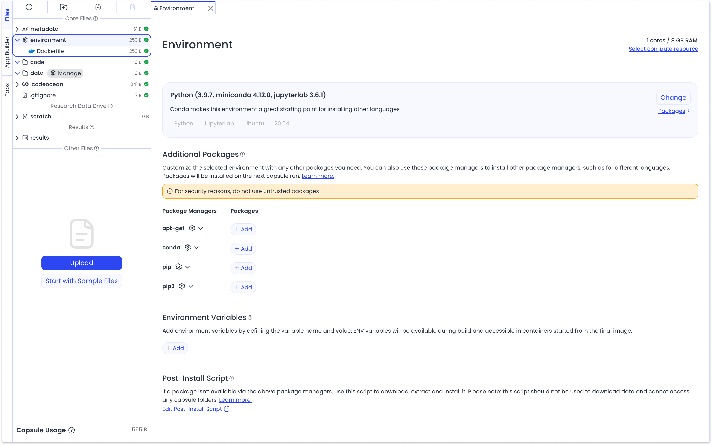
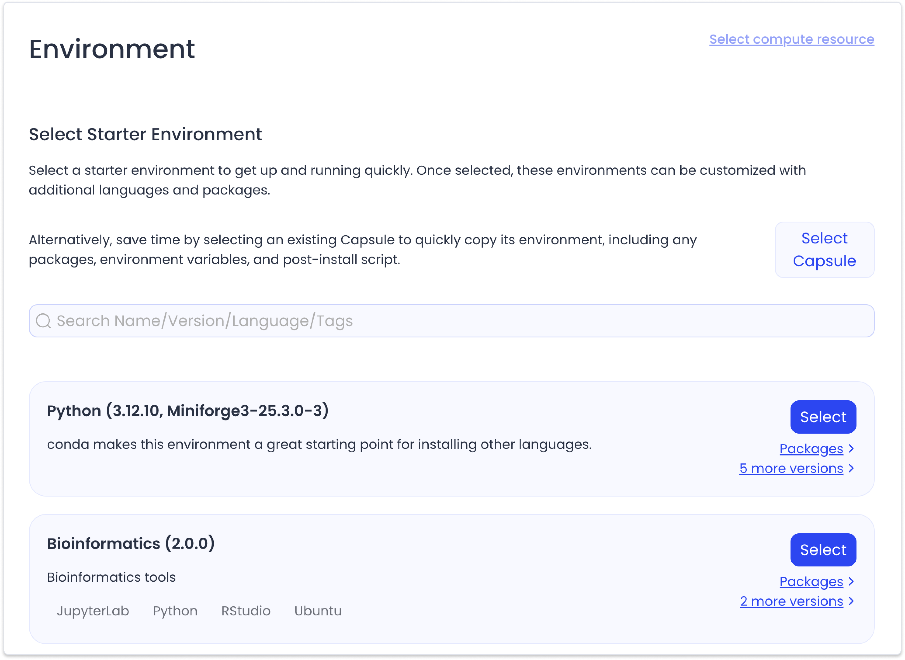
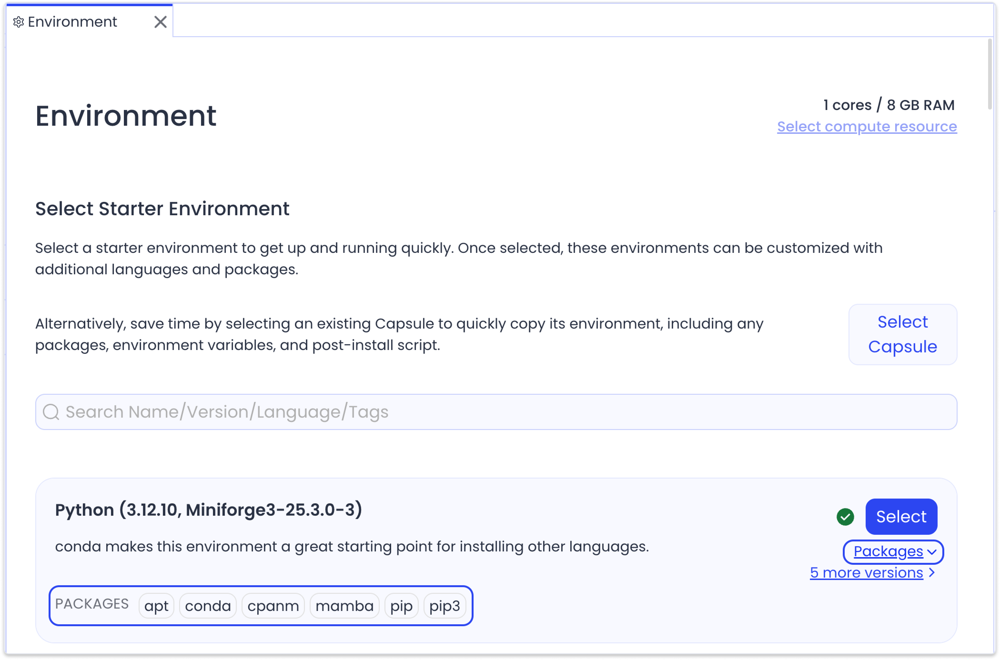
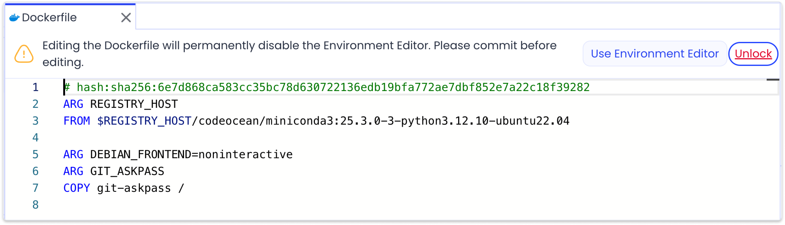
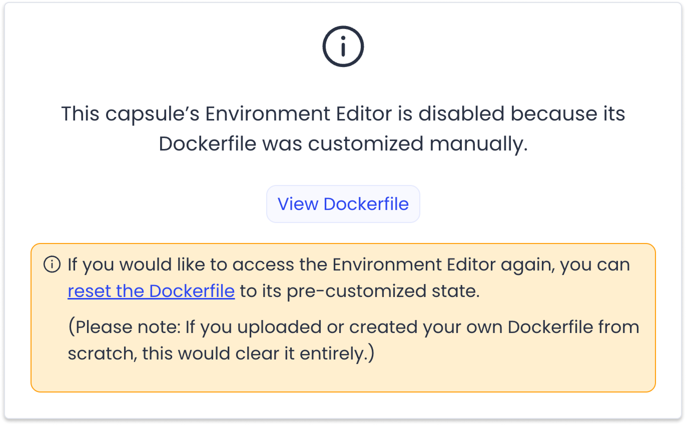

---
metaLinks:
  alternates:
    - >-
      https://app.gitbook.com/s/PvA82xvbvyt7rVs0IKXN/setting-up-the-environment/starter-environment
---

# Selecting a Starter Environment

## Navigate to the Environment Editor

Click the `/environment` folder to open the Environment Editor. Code Ocean uses Docker as the underlying tool to build and preserve the Capsule environment. When adding a package, the Environment Editor writes the information to a Dockerfile in the `/environment` folder.

<figure><figcaption></figcaption></figure>


Any edit made in the `/environment` folder triggers a change in the Dockerfile, which **could result in a complete rebuild** of the Docker image during a subsequent Reproducible Run or Cloud Workstation session. The wait time for the Docker image rebuild varies according to the number and complexity of packages installed.


## Selecting a Starter Environment

The first step when setting up the computational environment is to select a Starter Environment, (also known as a Docker base image). The Environment Editor lists all the Starter Environments available and allows you to search by name, version, language, and tags.


In addition to determining the base software and package managers that will be available in the Capsule, the Starter Environment also determines if GPU or CPU Compute Resources will be available from within the Capsule. You can learn more about Compute Resources [here](compute-resources.md).


If the Starter Environment has multiple versions, the latest version will be displayed by default and you can click the version dropdown to choose a different version.

<figure><figcaption></figcaption></figure>

Click **Select** to choose the Starter Environment.&#x20;

You can view all of the packages installed in a Starter Environment by clicking the drop-down menu to expand/collapse the package managers that were installed. Click on a package manager to open an information box listing the packages installed via that package manager along with their version numbers.&#x20;

## Considerations When Choosing a Starter Environment

* **When not using a pre-installed language**, use a base Ubuntu (16.04,18.04,20.04) environment.
* **When proprietary software**, such as MATLAB or Stata is required, begin from an environment with the proprietary language.
* **When using a GPU**, select an environment with GPU access. These are labeled accordingly, or will reference CUDA or a deep learning framework. You can easily filter for GPU Starter Environments by typing "GPU" in the search box.

## Starter Environments for Specific Cloud Workstations

If you would like to work in a Cloud Workstation, it may be required to choose a Starter Environment which supports that Cloud Workstation. Below is a guide to the available Cloud Workstations and their compatible programming languages and Starter Environments.

| Cloud Workstation                                         | Compatible Language | Note                                                                         |
| --------------------------------------------------------- | ------------------- | ---------------------------------------------------------------------------- |
| Terminal                                                  | all                 |                                                                              |
| Jupyter Lab/ Jupyter Notebook                             | mostly Python       | 
You can install other kernels and  use different languages
         |
| RStudio                                                   | R                   |                                                                              |
| MATLAB                                                    | MATLAB              | View the information box below for more detail.                              |
| Code-Server (VSCode)                                      | all                 |                                                                              |
| 
Ubuntu Desktop (IGV, 

Pytorch Desktop, etc.)
 | all                 | Requires use of Ubuntu Desktop Starter Environment                           |
| Shiny                                                     | R                   |                                                                              |
| IGV                                                       | all                 | Requires use of Starter Environment with IGV installed (i.e. Ubuntu Desktop) |
| Streamlit                                                 | Python              |                                                                              |


The MATLAB Cloud Workstation is a MATLAB interface that requires specific licenses and configurations set up in a MATLAB Starter Environment. To use the Matlab Cloud Workstation, you must choose MATLAB as your Starter Environment.

You need MATLAB credentials for executing Reproducible Runs and entering the Cloud Workstation. Visit [this article](../cloud-workstation/launching-a-cloud-workstation/using-matlab-in-code-ocean.md) for more details.


### Dockerfiles In Code Ocean&#x20;

When you first select your Starter Environment, a Dockerfile will be created in your `environment` folder. This file contains all the necessary commands that will be used to build your custom environment in your Capsule during computations. As more packages are added via the Environment Editor they will be synchronously added to the Dockerfile.

.png>)

To manually customize your Capsule environment you can open the Dockerfile and unlock it. This is not recommended as it will permanently disable the Environment Editor and all subsequent changes to the environment will need to be made through the Dockerfile.

<figure><figcaption></figcaption></figure>

<figure><figcaption></figcaption></figure>

## Copy the Environment from an Existing Capsule

Click **Select Capsule** for a shortcut to quickly copy the environment from an existing Capsule. This will copy over the Starter Environment, as well as any packages, environment variables, and Post-Install Script. If a Release Capsule is selected, a dropdown list allows you to choose a specific version if multiple versions are available. If a non-Release Capsule is selected, the latest environment will be copied.&#x20;


This method is a one-time copy and no link is maintained between Capsule environments.&#x20;


<figure><figcaption></figcaption></figure>

